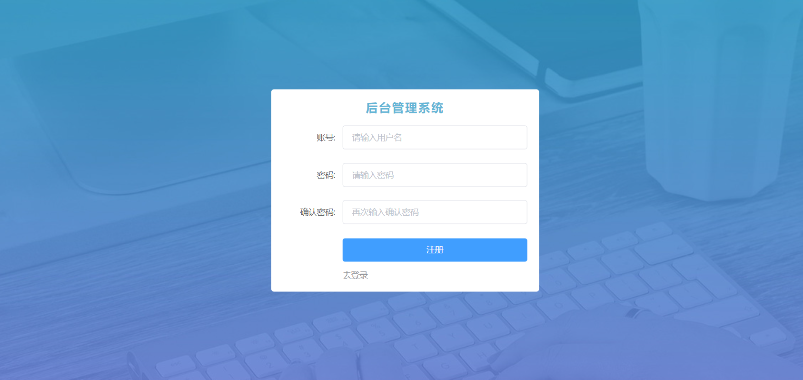

# 一、项目准备

## 01.项目-简介

#### 所需的前置知识

1. **Vue 基础**
   + vue-cli、指令、组件、vue-router路由、vuex
   
2. **axios**
   + baseURL、拦截器
   
3. **element-ui**
   + 安装与配置、常用的组件
   
4. **npm 与 模块化**
+ 能使用 npm 维护项目中的依赖包
  
+ ES6 模块化语法


## 02.项目-初始化

1. 确认自己vue命令版本

   * 查看vue命令版本(注意: 是大V)

     ```bash
     vue -V
     ```

   * 如果不是5.x版本, 可以执行命令更新

     ```bash
     npm i @vue/cli -g
     ```

2. 采用自定义预设来创建项目(或者使用你之前保存过的预设)

   * 需要vue2版本
   * 需要babel
   * 需要vue-router
   * 需要vuex
   * 需要eslint
   * 需要less

3. 如果你没有保存过以上的预设, 请按照下面步骤选择, 如果有则此步骤略过

   > 选择第3个 自定义预设

   

   初始化 vue-cli 的核心步骤：

   1.  Manually select features
       + **(*) Babel**
       + ( ) TypeScript
       + ( ) Progressive Web App (PWA) Support
       + **(*) Router**
       + **(*) Vuex**
       + **(*) CSS Pre-processors**
       + **(*) Linter / Formatter**
       + ( ) Unit Testing
       + ( ) E2E Testing
   2.  Choose a version of Vue.js that you want to start the project with (Use arrow keys)
       + **2.x**
       + 3.x
   3.  Use history mode for router? (Requires proper server setup for index fallback in production) (Y/n)
       + **n**
   4.  Pick a CSS pre-processor (PostCSS, Autoprefixer and CSS Modules are supported by default): (Use arrow keys)
       + Sass/SCSS (with dart-sass)
       + Sass/SCSS (with node-sass)
       + **Less**
       + Stylus
   5.  Pick a linter / formatter config: (Use arrow keys)
       + ESLint + Airbnb config
       + **ESLint + Standard config**
       + ESLint + Prettier
   6.  Pick additional lint features: (Press <space> to select, <a> to toggle all, <i> to invert selection)
       + **(*) Lint on save**
       + ( ) Lint and fix on commit
   7.  Where do you prefer placing config for Babel, ESLint, etc.? (Use arrow keys)
       + **In dedicated config files**
       + In package.json
   8.  Save this as a preset for future projects? (y/N)
       + **N**

   

4. 梳理项目结构

   0. 引号错误：新建一个`.prettierrc`文件,加入以下配置

   > {
   >
   >   "semi": false, //去掉结尾的分号
   >
   >   "singleQuote":true, //单引号替换双引号
   >
   >   "trailingComma": "none" //末尾禁止加引号
   >
   > }

   > 为项目开发做准备，把不需要的代码、文件删除掉

   1. 重置 `src/App.vue` 组件中的代码

      ```vue
      <template>
        <div>App 根组件</div>
      </template>
      
      <script>
      export default {
        name: 'App'
      }
      </script>
      
      <style lang="less" scoped></style>
      
      ```

   2. 重置 `src/router/index.js` 路由模块中的代码

      ```js
      import Vue from 'vue'
      import VueRouter from 'vue-router'
      
      Vue.use(VueRouter)
      
      const routes = []
      
      const router = new VueRouter({
        routes
      })
      
      export default router
      
      ```

   3. 清空 `src/components` 目录和 `src/views` 目录。

   4. 把**图片素材**目录下的 **images 文件夹**（项目中需要用到的图片），复制粘贴到 **src/assets** 目录下。

   5. 并把global.less, 引入到main.js

      ```js
      import '@/assets/global.less' // 全局初始化样式
      ```

      

1. **初始化模板都有什么功能?**

   <details>
   <summary>答案</summary>
   <ul>
   <li>得到一个脚手架基础环境, 有babel, vue-router和vuex, 以及支持vue语法和vue文件开发的webpack0配置环境</li>
   </ul>
   </details>


## 03.项目-ESLint介绍及使用

### 1.ESLint是什么

[ESLint](http://eslint.cn/) 是一个**代码检查工具**，用来检查你的**代码是否符合指定的规范**

* 例如: = 的前后必须有一个空格
* 例如: 函数名后面必须有空格
* 例如: await必须用用在async修饰的函数内
* 例如: ==必须转换成3个等
* ........

### 2.ESLint的好处

* 在写代码过程中, 检查你代码是否错误, 给你`小黑屋`提示

* ESLint可以约束团队内代码的风格统一

> `ESLint是法官, Standard是法律`

### 3.ESLint的规范

规范文档: http://www.verydoc.net/eslint/00003312.html

规范文档2: https://standardjs.com/rules-zhcn.html

规范文档3: http://eslint.cn/docs/rules/

### 4.ESLint使用

在代码里随便多写几个回车, ESLint会跳出来`刀子嘴`, `豆腐心`的提示你. 

在webpack开发服务器终端 / 浏览器 => 小黑屋


> eslint 是来帮助你的。心态要好，有错，就改。

把第4步规则名字, 复制到上面规范里查找违反了什么规则 / 根据第三步提示修改，

### 5.ESLint工作过程

1. 我们vue初始化项目的时候, 选择需要`eslint`功能, 以及`standard`检查规则
2. 确保**vscode根目录**有`eslintrc`配置文件, vscode工作区(目录环境), 会根据配置来检查你的代码
3. 当前项目下, 编写的代码, 违反eslint规则, 会在**终端**报错

> 报错在终端显示**红叉**

### 6.ESLint工作环境

1. webpack+eslint检查代码, 在终端输出检查报错结果
2. Vscode+ESLint插件, 在编写代码区域报错结果+自动修复

### 7.ESLint插件

> 使用ESLint插件, 填入配置, 它会根据你当前项目的eslint配置来帮助你自动修复一些语法代码问题

1. 在VSCode中, 下载这个插件


2. **非常非常非常重要**

一定要把脚手架工程, 作为vscode**根目录**, 因为vscode+eslint插件要使用配置文件`.eslintrc`, 按照这个的规则检查你的代码


3. 一定要配置插件监测的时机, 修改ESLint插件配置


不用管别的(你的插件和我图片所示不一样, 你的可能多/少), 把红框的放在{}内即可

```js
"eslint.run": "onType",
"editor.codeActionsOnSave": {
	"source.fixAll.eslint": true
}
```

> 更多的规则可以参考这里: https://www.cnblogs.com/jiaoshou/p/12218642.html

4. 检查是否生效

   * 随便在src下的任意文件里多敲击几个回车, vscode报错提示, 证明ESLint插件开始工作

   * ctrl + s 报错下是否能自动修复部分问题, 可以, 证明ESLint插件开始工作

> 如果不工作, 请按照此文件检查: https://kdocs.cn/l/crar3sGM9wFs

### 8.自定义规则

在.eslintrc.js文件中, 可以调整规则(团队内可以自定义自己一套)


rules是一个对象，以键值对的格式来约定规则：

- 键名是规则名
- 值是这条规则的具体说明。最常见的有off,warn,error

### 9.总结

1. 什么是ESLint?

   <details>
   <summary>答案</summary>
   <ul>
   <li>代码检查工具</li>
   </ul>
   </details>

2. 为什么要使用ESLint?

   <details>
   <summary>答案</summary>
   <ul>
   <li>规范我们写代码的格式, 看着整洁 / 团队内成员风格统一</li>
   </ul>
   </details>

3. ESLint在哪里生效?

   <details>
   <summary>答案</summary>
   <ul>
   <li>webpack开发服务器(终端和网页)+vscode(前提安装了eslint插件)</li>
   </ul>
   </details>

4. VSCode+ESLint插件有何作用?

   <details>
   <summary>答案</summary>
   <ul>
	 <li>可以根据项目环境的eslint配置来自动修复部分代码问题</li>
   </ul>
   </details>


## 04.项目-配置组件库

> 参照 element-ui 的官方文档，进行安装、配置、使用：https://element.eleme.io/#/zh-CN/component/installation

1. 下载element-ui包到当前项目(注意它支持的是Vue2版本项目)

   ```bach
   yarn add element-ui
   npm i element-ui -S
   ```

2. 封装新建`src/elementUI/index.js`, 在这里进行组件引入和注册

   ```js
   // main.js写太多内容容易混乱,每个功能单独一个文件分开管理
   // 引入Vue
   import Vue from 'vue'
   // 引入并使用ElementUI
   import ElementUI from 'element-ui'
   // 引入样式
   import 'element-ui/lib/theme-chalk/index.css'
   
   // 使用ElementUI
   Vue.use(ElementUI)
   ```
   
3. 在main.js中引入, 使其参与到webpack打包并在网页生效

   ```js
   // 让elementUI注册的代码参与打包,才能在页面上运行并注册组件
   import '@/elementUI/index'
   ```


### 总结

1. 为何elementUI注册单独封装个模块文件?

   <details>
   <summary>答案</summary>
   <ul>
   <li>分散管理, 方便查找</li>
   </ul>
   </details>


## 05.项目-封装请求库

核心思想: **分层架构**

* 在任意组件, 调用封装的接口方法, 接口方法调用统一的axios函数告诉他请求的参数, 它去请求数据

  > 我(任意组件) -> 秘书(接口函数) -> 车(axios) -> 数据(后台返回)
  
  * utils:工具包


1. 安装 axios

   > 在其他目录下存在报错：
   >
   > 	解决：npm install axios --save --legacy-peer-deps

   ```bash
   yarn add axios
   npm i axios
   ```

2. 新建`src/utils/request.js`项目核心请求方法的模块文件

   ```js
   // 基于axios 封装网络请求函数
   import axios from 'axios'
   
   // axios.create() 创建并导出一个带配置的自定义axios函数(比原axios多了个基地址)
   // myAxios请求的时候，地址是baseURL+url,然后去请求后台
   export default axios.create({
     // 设置基地址
     baseURL: 'http://big-event-vue-api-t.itheima.net'
   })
   ```

3. 新建`src/api/index.js`项目接口方法统一管理模块文件

   ```js
   // 封装的是具体的接口方法
   // 注意，每个方法只负责一个url地址
   import request from '@/utils/request' // 引入自定义axios函数
   
   // 导出接口方法，为了在逻辑页面引入可以调用
   export const registerAPI = () => {
     // 原地是一个promise对象
     // return这个promise对象到逻辑页面，去那边对promise对象提取结果
     // 这里先用这个数据测试下, 如果url以http开头会忽略baseURL, axios直接请求此地址
     return request({
       url: '/api/reg',
       method: 'post',
       data: {
         username: 'llidong',
         password: '2224444',
         repassword: '2224444'
       }
     })
   }
   ```

4. 在任意组件`src/App.vue`中, 引入接口请求方法, 并请求数据

   ```vue
   <template>
     <div>
       <el-button>111</el-button>
     </div>
   </template>
   
   <script>
   import { registerAPI } from './api'
   export default {
     async created () {
       const res = await registerAPI()
       console.log(res)
     }
   }
   </script>
   
   <style lang="less">
   </style>
   ```


> 这种分层架构思想, 可以更好的统一管理项目中所有接口, 并也方便统一给axios方法添加拦截器和修改基地址


### 总结

1. 为何要把网络请求封层, 分文件模块来管理?

   <details>
   <summary>答案</summary>
   <ul>
   <li>便于管理和查找, 以及替换和修改</li>
   </ul>
   </details>

2. 网络请求, 封装了哪些东西?

   <details>
   <summary>答案</summary>
   <ul>
   <li>utils/request.js网络请求工具函数, api/index.js定义具体请求的接口方法和传参, 在任意组件调用接口方法请求拿到数据</li>
   </ul>
   </details>


## 06.项目-git使用

### 1.新项目-本地仓库

1. 创建脚手架项目后, 再项目目录下, 使用如下命令, 初始化本地git仓库

   > 标志: 有个.git隐藏的文件夹, 它保存git相关一切, 并且它所在的本地文件夹就是git仓库, 

   ```bash
   git init
   ```

2. 把刚新建的并配置好的代码, 可以暂存, 本地提交一次, 产生一次提交记录, 让git快照记录一次

   ```bash
   # 暂存当前目录下所有变化的文件, 到内存
   git add . 
   # 本地提交, 才真的被git记录了一次快照在磁盘
   git commit -m '项目模板, 自定义初始化完成'
   ```

### 2.新项目-远程仓库

1. 目的: 代码保存到远程

   * github网站注册账号并且登录
   * github网站创建仓库

2. 根据网站的命令操作(**已有本地仓库**)

   > 只有第一次需要 -u origin master, 以后直接git push

   ```bash
   git remote add origin 远程仓库地址(自己去网页看)
   git push -u origin master //第一次才需要
   ```


3. 上传成功可以去github上看

   > 如果公司自己git服务器, 没有网页, 需要git log看提交记录

### 3.新旧项目-以后提交和推送

> 本地开发代码, 变化后

* 先本地提交保存(暂不保存到远程仓库上)

  ```js
  git add .
  git commit -m '提交说明,一定要写清楚,方便以后回滚'
  ```

* 要推送到远程的话才执行这句

  > 因为本地仓库和远程仓库, 已经建立好链接前面, 所以直接推送即可

  ```js
  git push
  ```

### 4.项目-克隆或拉取

> 如果刚进公司, 本地没有git仓库和代码, 需要的是克隆

* 第一次克隆下来

  * 注意: http/https开头的地址, 需要账号密码才能克隆/推送
  * 注意; git@开头的地址, 需要ssh秘钥文件配置好, 才能免账号密码克隆/推送

  ```js
  git clone 远程git仓库地址
  ```

* 多人协同开发一个项目, 别人推送了, 以后直接拉取更新即可

  > 如果提示有冲突, 打开代码, 找到对方商量合并冲突
  >
  > 前提: 你本地有变化必须暂存提交后, 才能拉取!!!

  ```js
  git pull
  ```

### 5.总结

1. git有什么作用?

   <details>
   <summary>答案</summary>
   <ul>
   <li>可以管理代码的版本(没提交一个功能可以有个记录, 随时可以回退)</li>
   </ul>
   </details>
   
   
2. 本地仓库和远程仓库区别?

   <details>
   <summary>答案</summary>
   <ul>
   <li>本地仓库在每个成员电脑本地, 而远程仓库一般在服务器上, 远程仓库类似网盘专门存储git版本提交记录和代码</li>
   </ul>
   </details>


# 二、注册-登录

## 2.1 注册

### 01.页面准备

1. 新建注册页面组件, 在`src/views/register/index.vue`, 直接复制标签

   ```vue
   <template>
     <div>reg</div>
   </template>
   
   <script>
   export default {
     name: 'my-register'
   }
   </script>
   
   <style lang="less" scoped>
   </style>>
   
   ```

2. 新建登录页面组件, 在`src/views/login/index.vue`, 直接复制标签

   ```vue
   <template>
     <div>login</div>
   </template>
   
   <script>
   export default {
     name: 'my-login'
   }
   </script>
   
   <style lang="less" scoped>
   </style>>
   
   ```

3. 在`src/router/index.js`配置路由表

   ```js
   import Vue from 'vue'
   import VueRouter from 'vue-router'
   
   Vue.use(VueRouter)
   const routes = [
     {
       // 注册的路由配置
       path: '/reg',
       /* webpack提供import函数来路由懒加载导入组件
       路由懒加载，就是页面路由路径切换到/reg ，才去加载对应组件代码
         好处：让首页加载文件体积更小，打开更快
       */
       component: () => import('@/views/register/index')
     },
     {
       // 登录的路由配置
       path: '/login',
       // 文件夹默认找index
       component: () => import('@/views/login')
     }
   ]
   
   const router = new VueRouter({
     routes
   })
   
   export default router
   
   ```

4. 在 `App.vue` 组件中，定义 `<router-view>` 如下

   > 可以把之前测试的代码直接覆盖掉

   ```vue
   <template>
     <div>
       <!-- 一级路由规则对象的挂载点 -->
       <router-view></router-view>
     </div>
   </template>
   
   <script>
   // import { registerAPI } from './api'
   export default {
   
   }
   </script>
   
   <style lang="less">
   </style>
   
   ```

5. 注册title组件

    ```vue
    <template>
      <!-- 标题的盒子 -->
      <div class="title-box">{{ title }}</div>
    </template>
    
    <script>
    export default {
      name: 'my-title',
    
      data () {
        return {
          title: '后台管理系统'
        }
      }
    }
    </script>
    
    <style lang="less" scoped>
    .title-box {
      height: 50px;
      text-align: center;
      line-height: 40px;
      font-size: 20px;
      font-weight: 700;
      color: rgb(99, 181, 214);
      // 改变字间距(左右)
      letter-spacing: 2px;
    }
    </style>
    
    ```

    

6. 启动webpack开发服务器, 然后在页面的地址栏, 手动切换路由地址看是否配置成功

7. 路由表是什么?

    <details>
    <summary>答案</summary>
    <ul>
    <li>指的路由规则对象的数组, 路由对象是路径和组件的映射关系</li>
    </ul>
    </details>


### 02.标签布局和表单校验

> css设置字体间距：
>
> word-spacing
>
> *  通过空格
>
> letter-spacing:xxx px

* **经验：**

  1. 前端绑定`数据对象属性名`,可以直接跟要调用的功能`接口的参数名`一致

  2. **好处:**

     >  我可以把前端对象(带着同名的属性和前端的值)发给后台,触发简写

* 完成注册页面, 标签和样式布局



1. 在`src/views/register/index.vue`, 初始化注册页面的基础布局，并美化样式, ==先看需求图, 分析后直接复制后阅读==

   ```vue
   <template>
     <!-- 注册页面的整体盒子 -->
     <div class="reg-container">
         <my-title />
         <!-- 标题的盒子 -->
         <div class="title"></div>
         <!-- 注册的表单区域 -->
       </div>
     </div>
   </template>
   
   <script>
   export default {
     name: 'my-register'
   }
   </script>
   
   <style lang="less" scoped>
   .reg-container {
     // 设置背景图
     background: url('../../assets/images/login_bg.jpg') center;
     // 自动铺满整个盒子
     background-size: cover;
     // 高度参考父级,也就是app.vue里面的父级
     height: 100%;
     .reg-box {
       background-color: #fff;
       border-radius: 5px;
       width: 450px;
       height: 320px;
       // 固定定位,实现居中效果
       position: absolute;
       top: 50%;
       left: 50%;
       transform: translate(-50%, -50%);
       padding: 15px 35px 10px 0;
       .btn-reg {
         // 修改注册按钮大小
         width: 100%;
       }
     }
   }
   </style>
   
   ```
   
2. 查找elementUI组件库, 要完成表单组件布局, 并带上基础校验, ==自己分析铺设, 变量可以看, 不可以复制==

   * 规则1: 用户名必须是1-10的大小写字母数字
   * 规则2: 密码必须是6-15的非空字符
   * 规则3: 确认密码必须和密码值一致

   ```vue
     <!-- 注册的表单区域 -->
         <el-form
           ref="form"
           :model="form"
           label-width="100px"
           :rules="rulesObj"
           :hide-required-asterisk="hideRequired"
         >
           <el-form-item label="账号:" prop="username">
             <el-input
               v-model="form.username"
               placeholder="请输入用户名"
             ></el-input>
           </el-form-item>
           <el-form-item label="密码:" prop="password">
             <el-input
               type="password"
               v-model="form.password"
               placeholder="请输入密码"
             ></el-input>
           </el-form-item>
           <el-form-item label="确认密码:" prop="rePassword">
             <el-input
               type="password"
               v-model="form.rePassword"
               placeholder="再次输入确认密码"
             ></el-input>
           </el-form-item>
           <el-form-item>
             <el-button type="primary" @click="registerFn" class="btn-reg"
               >注册</el-button
             >
             <el-link type="info">去登录</el-link>
           </el-form-item>
         </el-form>
   
   
   <script>
   // 经验:
   /*
     前端绑定数据对象属性名,可以直接跟要调用的功能接口的参数名一致
     好处:我可以把前端对象(带着同名的属性和前端的值)发给后台,触发简写
   */
   export default {
     name: 'my-register',
     data () {
       // 定义校验函数,必须在data里面定义,以确保能够使用this.form
       const checkRePassword = (rule, value, callback) => {
         if (value !== this.form.password) {
           // 如果验证失败,那调用回调函数,抛出一个Error
           callback(new Error('两次输入的密码不一致!!!'))
         } else {
           // 如果验证成功,直接执行回调函数
           callback()
         }
       }
       return {
         title: '后台管理系统',
         form: { // 表单数据对象
           username: '', // 用户名
           password: '', // 密码
           rePassword: '' // 确认密码
         },
         hideRequired: true, // 隐藏必填项的红色*
         // 表单规则校验对象,里面的规则名字和属性名字一样
         rulesObj: {
           username: [
             { required: true, message: '请输入用户名', trigger: 'blur' },
             // pattern:正则匹配,大小写字母加数字,长度限定为1-10个字符,trigger是触发的条件(blur:失去焦点),message:输入错误时提示的信息
             { pattern: /^[a-zA-Z0-9]{1,10}$/, message: '用户名必须是长度1-10的大小写字母和数字', trigger: 'blur' }
           ],
           password: [
             { required: true, message: '请输入密码', trigger: 'blur' },
             // \S代表非空
             { pattern: /^\S{6,15}$/, message: '密码必须是6-15位的非空字符', trigger: 'blur' }
           ],
           // 自定义
           rePassword: [{ required: true, message: '请再次输入密码', trigger: 'blur' }, {
             validator: checkRePassword, trigger: 'blur'
           }, { pattern: /^\S{6,15}$/, message: '密码必须是6-15位的非空字符', trigger: 'blur' }]
         }
   
       }
     }
   }
   </script>
   ```


1. 写任何需求的套路是什么?

   <details>
   <summary>答案</summary>
   <ul>
   <li>先准备标签和样式, 然后准备数据/变量绑定/校验规则设置</li>
   </ul>
   </details>


### 03.功能实现

* 核心思想: 注册就是把用户输入的账号和密码做好**校验以后**, 收集到变量中, 再调用接口发给后台, 后台代码把他们存储到数据库中, 再给前端返回提示

1. 注册按钮, 绑定点击事件

   ```vue
   <el-button type="primary" class="btn-reg" @click="regNewUserFn">注册</el-button>
   ```

2. 在事件处理函数中, 先执行表单校验

   ```js
   methods: {
       // 注册新用户,注册=>点击事件
       registerFn () {
         // 进行表单预验证
         this.$refs.form.validate(valid => {
           // valid是布尔值
           if (!valid) return false
           // 尝试拿到用户输入的内容
           console.log(this.form)
         })
       }
     }
   ```

3. 前端准备好了, 准备调用后台接口了, 所以准备接口方法, 在`src/api/index.js`定义

   ```js
   /* 函数形参的对象解构赋值方法
    registerAPI(this.form)
    相当于
    registerAPI({
         username: '',
         password: '',
         rePassword: ''
    })
    左侧想用对象的解构赋值(语法)
    ES6规定,key和value变量同名时,可以简写(key即是key也是value变量名)
   */
   export const registerAPI = ({ username, password, rePassword }) => {
     // 原地是一个promise对象
     // return这个promise对象到逻辑页面，去那边对promise对象提取结果
     // 这里先用这个数据测试下, 如果url以http开头会忽略baseURL, axios直接请求此地址
     return request({
       url: '/api/reg',
       method: 'post',
       // axios 传参params,data
       // params的对象参数名和值, axios源码会把他的参数和值拼接在url?后面给后台(query查询字符串)
       // data的对象参数名和值,axios源码会把参数和值,拼接在请求体里面(对应后台是body参数)
       data: {
         username,
         password,
         repassword: rePassword
       }
     })
   }
   
   ```

4. 在逻辑页面引用接口, 并在注册逻辑中调用, 并使用element绑定在Vue全局属性上的$message弹窗方法

   ```js
   //注册新用户
   methods: {
       // 注册=>点击事件
       registerFn () {
         // js兜底校验
         this.$refs.form.validate(async valid => {
           // valid是布尔值
           if (valid) {
             // 通过校验
             console.log(this.form)
             // registerAPI(this.form) // 返回一个promise对象
             // 1.调用注册接口
             // 解构赋值,把axios返回的数据对象data字段对应的值保存在res上
             const { data: res } = await registerAPI(this.form)
             console.log(res)
             // 2.注册失败,提示用户
             if (res.code !== 0) {
               // elementUI在vue的原型链上添加了弹窗提示,$message属性
               // return必须有,作用:阻止代码往下执行
               return this.$message.error(res.message)
             }
             // 3.注册成功,提示用户
             this.$message.success(res.message)
             // 4.跳转到登录页面
             this.$router.push('/login')
           } else {
             console.log('error')
             return false // 阻止默认提交行为(表单下面红色提示会自动出现)
           }
         })
       }
     }
   ```
   
5. 注册的业务逻辑是什么?

    <details>
    <summary>答案</summary>
    <ul>
    <li>把前端标签准备好, 数据绑定好, 在点击事件中走完表单验证逻辑, 调用接口传参给后台, 根据后台返回的code做前端页面结果提示</li>
    </ul>
    </details>

* ```js
  Do not use built-in or reserved HTML elements as component id: title
  组件名和html内置重名
  ```

* 

## 2.2 登录

### 1.标签布局和表单校验


1. 和注册页面差不多, 标签和校验一样, 在`src/views/login/index.vue`中, 复制如下标签并阅读核对

   ```vue
   <template>
     <!-- 注册页面的整体盒子 -->
     <div class="login-container">
       <!-- 注册的盒子 -->
       <div class="login-box">
         <my-title />
         <!-- 注册的表单区域 -->
         <el-form
           ref="loginForm"
           :model="loginForm"
           label-width="60px"
           :rules="loginRules"
           :hide-required-asterisk="hideRequired"
         >
           <!-- 用户名 -->
           <el-form-item label="账号:" prop="username">
             <el-input
               v-model="loginForm.username"
               placeholder="请输入用户名"
             ></el-input>
           </el-form-item>
           <!-- 密码 -->
           <el-form-item label="密码:" prop="password">
             <el-input
               type="password"
               v-model="loginForm.password"
               placeholder="请输入密码"
             ></el-input>
           </el-form-item>
           <el-form-item>
             <el-button type="primary" @click="loginFn" class="btn-login"
               >登录</el-button
             >
             <!-- 跳转注册路由 -->
             <el-link type="info" @click="$router.push('/reg')">去注册</el-link>
           </el-form-item>
         </el-form>
       </div>
     </div>
   </template>
   
   <script>
   import myTitle from '@/components/Title.vue'
   export default {
     components: { myTitle },
     name: 'my-login',
     data () {
       return {
         loginForm: {
           username: '',
           password: ''
         },
         hideRequired: true, //隐藏红*
         // 定义登录规则对象
         loginRules: {
           username: [
             { required: true, message: '请输入用户名', trigger: 'blur' },
             { pattern: /^[a-zA-Z0-9]{1,10}$/, message: '用户名必须是长度1-10的大小写字母和数字', trigger: 'blur' }
           ],
           password: [
             {
               required: true, message: "请输入密码", trigger: 'blur'
             },
             {
               pattern: /^\S{6-15}$/, message: "密码必须是6-15位的非空字符哦!", trigger: 'blur'
             }
           ]
         }
       }
     },
   }
   </script>
   
   <style lang="less" scoped>
   .login-container {
     // 设置背景图
     background: url('../../assets/images/login_bg.jpg') center;
     // 自动铺满整个盒子
     background-size: cover;
     // 高度参考父级,也就是app.vue里面的父级
     height: 100%;
     .login-box {
       background-color: #fff;
       border-radius: 5px;
       width: 410px;
       height: 280px;
       // 固定定位,实现居中效果
       position: absolute;
       top: 50%;
       left: 50%;
       transform: translate(-50%, -50%);
       padding: 15px 30px 0 10px;
   
       .btn-login {
         // 修改注册按钮大小
         width: 100%;
       }
     }
   }
   </style>>
   ```

   

2. 实现注册页面, 点击去登录跳转效果, 在`src/views/register/index.vue`中, 找到对应标签绑定点击事件跳转路由页面

   ```vue
   <el-link type="info" @click="$router.push('/login')">去登录</el-link>
   
   ```


3. 实现登录页面, 点击去注册跳转效果, 在`src/views/login/index.vue`中, 找到对应标签点击中跳转路由

   ```vue
   <el-link type="info" @click="$router.push('/reg')">去注册</el-link>
   ```


4. 登录和注册如何做的, 核心思想?

<details>
<summary>答案</summary>
<ul>
<li>用的是2个页面, 做的切换, 其实也可以做标签的显示隐藏, 都能实现</li>
</ul>
</details>


### 2.功能实现

* 核心思想: 通过表单校验, 收集用户输入内容, 调用接口带给后台验证, 返回响应结果, 前端给用户提示结果

1. 为登录按钮绑定点击事件处理函数如下

   ```vue
   <el-button type="primary" class="btn-login" @click="loginFn">登录</el-button>
   ```

2. 先封装要调用的登录接口, 在`src/api/index.js`中

   ```js
   /**
    * 登录接口
    * @param {*} param0 { username: 用户名, password: 密码 }
    * @returns Promise对象
    */
   export const loginAPI = ({ username, password }) => {
     return request({
       url: '/api/login',
       method: 'post',
       data: {
         username,
         password
       }
     })
   }
   ```

   

3. 在`src/view/login/index.vue`登录页面, 引入接口方法并, 实现对应事件处理函数逻辑, 校验和调用接口

   ```js
   methods: {
       // 登录的点击事件 ,js兜底检验,防止不输入也可以登录
       loginFn () {
         this.$refs.loginForm.validate(async valid => {
           if (valid) {
             // 拿到关联的数据
             console.log(this.loginForm);
             // 调用loginAPI,解构赋值data并重命名为res
             const { data: res } = await loginAPI(this.loginForm)
             // 根据后台返回的信息做判断,给用户提示
             if (res.code !== 0) {
               // 返回失败,写{} 不用写return
               this.$message(
                 {
                   // 自定义样式
                   type: 'error',
                   message: res.message,
                   customClass: 'myBox',
                 }
               )
             } else {
               // 返回成功
               this.$message({
                 type: 'success',
                 message: res.message,
                 customClass: 'myBox',
               })
             }
           } else {
             return false
           }
         })
       }
     },
   ```
   
   

4. 登录的逻辑是什么?

   <details>
   <summary>答案</summary>
   <ul>
   <li>把前端标签准备好, 数据绑定好, 在点击事件中走完表单验证逻辑, 调用接口传参给后台, 根据后台返回的code做前端页面结果提示</li>
   </ul>
   </details>


### 3.结果存入vuex中

1. 在`src/store/index.js`中定义, state里的token变量（为了让用户登录）, 以及更新token的 `updateToken`  mutation 函数

   ```js
   export default new Vuex.Store({
     state: {
       // 1. 用来存储登录成功之后，得到的 token
       token: ''
     },
     mutations: {
       // 2. 更新 token 的 mutation 函数
       updateToken(state, newToken) {
         state.token = newToken
       }
     }
   })
   ```

2. 在`src/views/login/index.vue`中, 在成功后, 调用vuex里的mutations方法

   > 可以直接调用 / 映射调用

   ```js
   import { mapMutations } from 'vuex'
   export default {
     // ...其他
     methods: {
       // 在组件对象(vc)中生成与mutations对话的方法
       ...mapMutations(['updateToken']),
       // 登录按钮->点击事件
       async loginFn () {
         this.$refs.loginForm.validate(async valid => {
            if (valid) {
             // 拿到关联的数据
             console.log(this.loginForm);
             // 调用loginAPI,解构赋值data并重命名为res
             const { data: res } = await loginAPI(this.loginForm)
             // 根据后台返回的信息做判断,给用户提示
             if (res.code !== 0) {
               // 返回失败,写{} 不用写return
               this.$message(
                 {
                   // 自定义样式
                   type: 'error',
                   message: res.message,
                   customClass: 'myBox',
                 }
               )
             } else {
               // 返回成功
               this.$message({
                 type: 'success',
                 message: res.message,
                 customClass: 'myBox',
               },
                 // 提交给mutations,把token字符串保存在vuex中
                 this.updateToken(res.token)
               )
             }
           } else {
             return false
           }
         })
       }
     }
   }
   ```

3. 登录后获取token, 保存vuex的代码执行思路是?

    <details>
    <summary>答案</summary>
    <ul>
    <li>在登录接口返回响应成功后, 提取后台返回的token字符串, 调用mutations方法, 把值暂存到vuex的state内变量上, 但是仅仅在内存中, 刷新后state里token变量会变成空字符串(又相当于没登录一样)</li>
    </ul>
    </details>


### 4.持久化存储vuex

* vuex默认保存在内存中,页面一刷新,就没了,所以要本地存储(无法做到持久存储)

> 自己写localStorage.setItem等 需要一个个写, 很麻烦

这里介绍一个vuex的插件包叫做`vuex-persistedstate@3.2.1`版本(配合vue2使用, 默认最新版是配合vue3使用)，可以做到持久存储

1. 下载此包到当前工程中

   ```bash
   yarn add vuex-persistedstate@3.2.1
   npm i vuex-persistedstate@3.2.1 --legacy-peer-deps
   ```

2. 在`src/store/index.js`中, 导入并配置

   ```js
   import Vue from 'vue'
   import Vuex from 'vuex'
   import createPersistedState from 'vuex-persistedstate'
   
   Vue.use(Vuex)
   
   export default new Vuex.Store({
     state: {
       // 1. 用来存储登录成功之后，得到的 token
       token: ''
     },
     mutations: {
       // 2. 更新 token 的 mutation 函数
       updateToken (state, newToken) {
         state.token = newToken
       }
     },
     // 配置为 vuex 的插件
     plugins: [createPersistedState()] //注入持久化插件
   })
   ```

3. 这次再来重新登录, 查看浏览器调试工具vuex和浏览器本地存储位置, 是否自动同步进入

4. 刷新网页看调试工具里vuex的默认值确实从本地取出了默认值, 保证了vuex的持久化

5. vuex为何要做持久化?

    <details>
    <summary>答案</summary>
    <ul>
    <li>vuex运行时的值保存在内存里, 如果刷新vuex的变量会变成初始化的,所以让他的默认初始化的值从本地取, 当有人赋值给vuex也同步覆盖式保存到本地一份</li>
    </ul>
    </details>


### 5.跳转布局页

1. 新建页面组件`src/views/layout/index.vue`, layout布局页面(它右下角包含的是**主页**), 直接根据需求画面

   ```vue
   <template>
     <!-- 主页布局 -->
     <el-container class="main-container">
       <!-- 头部区域 -->
       <el-header>
         <!-- 左边的图片 -->
         
         <!-- 右边的菜单栏 -->
         <el-menu
           class="el-menu-top"
           mode="horizontal"
           background-color="#23262e"
           text-color="#fff"
           active-text-color="#409EFF"
         >
           <el-submenu index="1">
             <template slot="title">
               <!-- 头像 -->
               
               <span>个人中心</span>
             </template>
             <el-menu-item index="1-1"
               ><i class="el-icon-s-operation"></i>基本资料</el-menu-item
             >
             <el-menu-item index="1-2"
               ><i class="el-icon-camera"></i>更换头像</el-menu-item
             >
             <el-menu-item index="1-3"
               ><i class="el-icon-key"></i>重置密码</el-menu-item
             >
           </el-submenu>
           <el-menu-item index="2"
             ><i class="el-icon-switch-button"></i>退出</el-menu-item
           >
         </el-menu>
       </el-header>
       <!-- 侧边栏区域 -->
       <el-container>
         <el-aside width="200px">Aside</el-aside>
         <el-container>
           <!-- 页面主体区域 -->
           <el-main>Main</el-main>
           <!-- 底部 footer 区域 -->
           <el-footer>Footer</el-footer>
         </el-container>
       </el-container>
     </el-container>
   </template>
   
   <script>
   export default {
     name: 'my-layout'
   
   }
   </script>
   
   <style lang="less" scoped>
   .main-container {
     height: 100%;
     .el-header {
       padding: 0;
       display: flex;
       justify-content: space-between;
       img {
         height: 100%;
       }
       .el-menu-top {
         position: relative;
       }
     }
   
     .el-footer {
       background-color: #eee;
       font-size: 12px;
       display: flex;
       justify-content: center;
       align-items: center;
     }
   
     .el-aside,
     .el-header {
       background-color: #23262e;
     }
   
     .el-main {
       overflow-y: scroll;
       height: 0;
       background-color: #f2f2f2;
     }
   }
   // 头像样式
   .pic {
     position: absolute;
     right: 120px;
     //   top: 0;
   
     // 设为圆形
     border-radius: 50%;
     width: 60px;
     height: 60px;
     background-color: #fff;
     //   防止挤压变形
     object-fit: cover;
   }
   </style>
   ```

   

2. 在`src/router/index.js`路由中配置规则和组件

   ```js
   {
       path: '/',
       component: () => import('@/views/layout')
   }
   ```


3. 在`src/views/login/index.vue`登录页面, 登录成功后跳转到主页

   ```js
   // 登录成功之后，跳转到后台主页
   this.$router.push('/')
   ```

   

4. layout布局页面是什么作用?

   <details>
   <summary>答案</summary>
   <ul>
   <li>如果发现主页有固定的部分, 比如固定左侧导航/固定头部导航/固定底部导航, 那么这个标签放在layout, 在这个layout页面切换的部分就是嵌套的下级路由</li>
   </ul>
   </details>


### 6.退出登录

* **经验：**

  * /在组件标签上绑定的所有事件(包括原生事件的名字click,input等)，都是自定义事件,都需要组件内$emit触发

  * 万一组件内不支持这个原生事件名字

    > 解决:@事件名.native="method里面的方法名"
    >
    > .native给组件内根标签,绑定这个原生事件

* 核心思想: 退出登录就是清除vuex和本地所有缓存的值, 然后页面强制切换到登录页面

1. 退出登录按钮, 点击事件绑定

   ```vue
   <el-menu-item index="2" @click="quitFn"><i class="el-icon-switch-button"></i>退出</el-menu-item>
   ```

2. 实现对应事件处理函数和提示

   ```js
   methods: {
       quitFn () {
         // 询问用户是否退出登录
         this.$confirm('您确认退出登录吗？', '提示', {
           confirmButtonText: '确定',
           cancelButtonText: '取消',
           type: 'warning'
         })
           .then(() => {
             // TODO：执行退出登录的操作
           })
           .catch((err) => err)
       }
     }
   ```

3. 执行退出逻辑代码

   ```js
   .then(() => {
       // TODO：执行退出登录的操作
       // 1. 清空 token
       this.$store.commit('updateToken', '')
       // 2. 跳转到登录页面
       this.$router.push('/login')
   })
   ```

   ```js
   quitFn () {
      // 为了让用户体验更好,需要确认框
      if (confirm('您要退出吗?')) {
        // 清除vuex
        // 把空字符串传给updateToken
        this.$store.commit('updateToken', '')
        // 强制跳转页面
        this.$router.push('/login')
      }
    }
   ```


4. 退出登录的业务逻辑是什么?

   <details>
   <summary>答案</summary>
   <ul>
   <li>就是把vuex和本地的值清空, 然后页面强制跳转到登录页面</li>
   </ul>
   </details>

5. 为何退出登录不用调用后台接口?

   <details>
   <summary>答案</summary>
   <ul>
   <li>因为我们采用的是前端存储token来表名用户登录的身份, 没有做单点登录(就是多个设备只能保证1个设备登录状态), 所以后端无需记录登录状态所以无接口调用</li>
   </ul>
   </details>


# 三、布局页

## 1.布局layout页面

### 1.1.左侧菜单-权限控制-个人中心

1. 在`src/api/index.js`模块中, 定义接口方法, 用于请求用户信息数据

   ```js
   /**
    * 获取用户信息接口
    * @param {*} param0 Authorization
    * @returns Promise对象
    */
   export const userInfoAPI = (()=>{
     return request({
       url:'/my/userinfo',
       // method不写默认为get
       method:'get',
       // 传参给后台：params（查询字符串query），data（请求体body),headers(请求头)
       headers:{
         // this.$store.state.token 这里this不是组件对象，不能用this.$store拿到store对象
         Authorization:store.state.token
       }
     })
   })
   ```

   

2. 在 `src/store/index.js` 模块中，使用接口方法+actions获取用户的基本信息

   ```js
   import { getUserInfoAPI } from '@/api'
   import Vue from 'vue'
   import Vuex from 'vuex'
   // 引入createPersistedState(本地持久存储)
   import createPersistedState from 'vuex-persistedstate'
   
   
   Vue.use(Vuex)
   
   export default new Vuex.Store({
     state: {
       token:'', //保存token字符串
       userInfo:{} // 保存用户信息(是对象有：id，username，nickname，email，user_pic)
     },
     getters: {
     },
     mutations: {
       // 保存token
       updateToken(state,value){
         state.token = value
       },
       // 把用户信息保存至state里面，需要处理，可以用action
       updateUserInfo(state,value){
         state.userInfo = value
       }
     },
     actions: {
        async getUserInfoAction(context){
         // userInfoAPI不需要传参，所以可以不写value
         let {data:res} = await getUserInfoAPI()
         // 成功就传给mutation加工
         if(res.data === 0){
           context.commit('updateUserInfo',res.data)
         }
       }
     },
     modules: {
     },
     plugins:[
       createPersistedState() //注入持久化插件
     ]
   })
   
   // vuex默认保存在内存中,页面一刷新,就没了,所以要本地存储
   ```

3. 在全局前置守卫, 做判断, 有token但是无userInfo信息, 才发请求拿用户信息, 在`src/router/index.js`中编写

   > 因为不确定先进入的哪个页面, 但是全局前置路由守卫必执行

   ```js
   // 全局前置路由守卫
   router.beforeEach((to, from, next) => {
     const token = store.state.token
     if (token && !store.state.userInfo.username) {
       // 本地有token,并且state里面的userInfo.username不为空，才去请求用户信息，避免重复请求
       // 调用actions里方法请求数据
       store.dispatch('getUserInfoAction')
     }
     next() //路由放行
   })
   ```
   
4. 最后效果就是, 登录后, 刷新后, 会在vue调试工具中查看vuex中userInfo有值即可

5. vuex保存用户信息的思路是?

   <details>
   <summary>答案</summary>
   <ul>
   <li>定义state变量和mutations以及actions方法, 在路由守卫中判断有token无vuex中userInfo用户信息的时候, 调用actions里的方法请求用户信息保存到state里userInfo中</li>
   </ul>
   </details>


### 1.2.布局-渲染用户信息

1. 在`src/views/layout/index.vue`, 左侧侧边栏, 渲染用户信息昵称/用户名

   ```vue
    <el-aside width="200px">
           <!-- 用户信息 -->
           <div class="user-box">
             <!-- 用户头像 -->
             
             <!-- 用户头像默认显示 -->
             
             <span>欢迎 {{ username || nickname }}</span>
           </div>
         </el-aside>
   
   
   <style lang="less" scoped>
   // 侧边栏样式
     .el-aside {
       .user-box {
         display: flex;
         justify-content: center;
         align-items: center;
         height: 70px;
         color: #fff;
         font-size: 14px;
         border-top: 1px solid #ccc;
         border-bottom: 1px solid #ccc;
         // 文字不可以选择，不能复制
         user-select: none;
         img {
           width: 45px;
           height: 45px;
           margin-right: 15px;
           border-radius: 50%;
           background-color: #fff;
           object-fit: cover;
         }
       }
     }
   </style>
   ```

2. 在vuex中, 定义getters, 定义并导出用户名和昵称

   ```js
   getters: {
       // 完整写法
       // username (state) {
       //   return state.userInfo.username
       // }
       // 箭头函数
       // username: ((state) => {
       //   return state.userInfo.username
       // })
       // 极致简写
       username: state => state.userInfo.username, //用户名
       nickname: state => state.userInfo.nickname, //昵称
       user_pic: state => state.userInfo.user_pic //用户头像
     },
   ```

3. 在`src/views/layout/index.vue`采用映射getters的方式定义计算属性

   ```js
   import { mapGetters } from 'vuex'
   export default {
     computed: {
        // 映射getters,数组写法，{ nickname: 'nickname' }是对象写法
       ...mapGetters(['username', 'nickname', 'user_pic'])
     }
   }
   ```


4. **总结：**用户信息如何渲染的?

    <details>
    <summary>答案</summary>
    <ul>
    <li>在vuex中把state映射成getters, 再用getters辅助函数映射到组件内使用state的值</li>
    </ul>
    </details>


## 2.侧边栏页面

### 2.1.导航布局

1. 在 `src/views/layout/index.vue` 组件的 `el-aside`范围内div标签兄弟关系，定义左侧菜单的 UI 布局结构

   ```xml
   <!-- 侧边栏区域 -->
       <el-container>
         <el-aside width="200px">
           <!-- 侧边栏用户信息 -->
           <div class="user-box">
             <!-- 用户头像 -->
             
             <!-- 用户头像默认显示 -->
             
             <span>欢迎 {{ username || nickname }}</span>
           </div>
           <!-- 侧边栏导航 -->
           <!-- 
             el-menu:导航菜单
               default-active：当前激活菜单的 index（对应el-submenu/el-menu-item的index值，这样菜单才有激活样式）
               @open:sub-menu 展开的回调
               @close:sub-menu 收起的回调
               active-text-color:激活时的文字颜色,哪个index的值和default-active一致，就会被动态设置文字颜色
   
               子标签：
               如果有嵌套，先写el-submenu（里面嵌套template名为title 设置当前展示内容，子用el-menu-item显示）
               如果无嵌套，直接写el-menu-item
            -->
           <el-menu
             default-active="/home"
             class="el-menu-vertical-demo"
             @open="handleOpen"
             @close="handleClose"
             background-color="#23262E"
             text-color="#fff"
             active-text-color="#409EFF"
           >
             <el-menu-item index="/home">
               <i class="el-icon-s-home"></i>
               <span slot="title">首页</span>
             </el-menu-item>
             <el-submenu index="/topic">
               <template slot="title">
                 <i class="el-icon-notebook-2"></i>
                 <span>文章管理</span>
               </template>
               <el-menu-item-group>
                 <!-- 分组可以在第一行显示组名 -->
                 <!-- <template slot="title">分组一</template> -->
                 <el-menu-item index="/topic1">文章1</el-menu-item>
                 <el-menu-item index="topic2">文章2</el-menu-item>
               </el-menu-item-group>
             </el-submenu>
             <el-submenu index="/my">
               <template slot="title">
                 <i class="el-icon-s-custom"></i>
                 <span>个人中心</span>
               </template>
               <el-menu-item-group>
                 <!-- 分组可以在第一行显示组名 -->
                 <!-- <template slot="title">分组一</template> -->
                 <el-menu-item index="/my1">个人1</el-menu-item>
                 <el-menu-item index="/my2">个人2</el-menu-item>
               </el-menu-item-group>
             </el-submenu>
           </el-menu>
         </el-aside>
         <el-container>
           <!-- 页面主体区域 -->
           <el-main>Main</el-main>
           <!-- 底部 footer 区域 -->
           <el-footer>Footer</el-footer>
         </el-container>
       </el-container>
   ```

2. 美化 `Main.vue` 组件的布局结构：

   ```less
   // 侧边栏菜单的样式
   .el-aside {
     .el-submenu,
     .el-menu-item {
       width: 200px;
       user-select: none;
     }
   }
   ```

   

1. **小结：**menu菜单标签的关系?

   <details>
   <summary>答案</summary>
   <ul>
   <li>menu下包含menu-item代表一行, 然后submenu是带子菜单的容器</li>
   </ul>
   </details>


### 2.2.导航数据

从后台请求侧边栏标题等数据, 铺设侧边栏导航

1. 在`src/api/index.js`封装请求侧边栏数据的接口方法

   ```js
   /**
    * 获取-侧边栏菜单数据
    * @returns Promise对象
    */
   export const getMenusAPI = () => {
     return request({
       url: '/my/menus',
       headers: {
         Authorization: store.state.token
       }
     })
   }
   ```

2. 在`src/views/layout/index.vue`组件中, 引入接口方法, 发请求拿到数据, 保存到data变量中

   ```js
   import { getMenusAPI } from '@/api'
   export default {
     // ...其他
     data () {
       return {
         menus: [] // 侧边栏数据
       }
     },
     created () {
       this.getMenusListFn()
     },
     methods: {
       // ...其他
       // 获取侧边栏菜单数据
       async getMenusListFn () {
         const { data: res } = await getMenusAPI()
         console.log(res)
         this.menus = res.data
       }
     }
   }
   ```

3. 循环渲染左侧的一级和二级菜单数据铺设

   ```vue
    <!-- 侧边栏导航 -->
           <!-- 
             el-menu:导航菜单
               default-active：当前激活菜单的 index（对应el-submenu/el-menu-item的index值，这样菜单才有激活样式）
               @open:sub-menu 展开的回调
               @close:sub-menu 收起的回调
               active-text-color:激活时的文字颜色,哪个index的值和default-active一致，就会被动态设置文字颜色
               router:设置上(默认为false)，是否使用 vue-router 的模式，启用该模式会在激活导航时以 index 作为 path 进行路由跳转
   
               子标签：
               如果有嵌套，先写el-submenu（里面嵌套template名为title 设置当前展示内容，子用el-menu-item显示）
               如果无嵌套，直接写el-menu-item
   
               属性没有显示传值，默认为true(背)
            -->
           <el-menu
             default-active="/home"
             class="el-menu-vertical-demo"
             @open="handleOpen"
             @close="handleClose"
             background-color="#23262E"
             text-color="#fff"
             active-text-color="#409EFF"
             unique-opened
           >
             <!-- template是配合vue指令用,不用写key -->
             <template v-for="item in menus">
               <!-- 自定义标签需要key -->
               <el-menu-item
                 v-if="!item.children"
                 :index="item.indexPath"
                 :key="item.index"
               >
                 <i :class="item.icon"></i>
                 <span slot="title">{{ item.title }}</span>
               </el-menu-item>
               <el-submenu v-else :index="item.indexPath" :key="item.indexPath">
                 <template slot="title">
                   <i :class="item.icon"></i>
                   <span>{{ item.title }}</span>
                 </template>
                 <el-menu-item-group
                   v-for="obj in item.children"
                   :key="obj.indexPath"
                 >
                   <!-- 分组可以在第一行显示组名 -->
                   <!-- <template slot="title">分组一</template> -->
                   <el-menu-item :index="obj.indexPath">
                     <i :class="obj.icon"></i>
                     {{ obj.title }}</el-menu-item
                   >
                 </el-menu-item-group>
               </el-submenu>
             </template>
           </el-menu>
         </el-aside>
   ```

4. 修改 `el-menu` 组件的 `default-active` 属性，可以设置默认激活的左侧菜单, 为首页路由路径

   ```vue
   <el-menu
       default-active="/home"
       class="el-menu-vertical-demo"
       background-color="#23262E"
       text-color="#fff"
       active-text-color="#409EFF"
       unique-opened
      ></el-menu>
   ```

5. 为 `el-menu` 组件添加 `router` 属性，可以开启左侧菜单的路由模式

   ```vue
   <el-menu
       default-active="/home"
       class="el-menu-vertical-demo"
       background-color="#23262E"
       text-color="#fff"
       active-text-color="#409EFF"
       unique-opened
       router
      ></el-menu>
   ```

6. 点击左侧导航, 查看路由地址是否切换

7. el-menu如何集成路由切换功能?

   <details>
   <summary>答案</summary>
   <ul>
   <li>index属性的值对应要切换的路由地址, el-menu上添加router属性即可</li>
   </ul>
   </details>


## 3.权限控制

### 3.1.axios-请求拦截器

掌握axios请求拦截器使用, 在其中统一携带token


1. 正常接口方法里, 在函数里请求headers参数需要写多个, 要修改需要改多处, 所以我们决定在请求拦截器统一携带

2. 在`utils/request.js`中, 使用自定义axios函数绑定请求拦截器, 判断有token再携带到请求头上

   ```js
   // 定义请求拦截器
   // api里每次调用request都会先走这个请求拦截器
   myAxios.interceptors.request.use(
     //请求前触发一次
     function (config) {
       // 返回axios内源码,config配置对象(要请求后台的参数都在这上面)
       // 在请求前会发一次,这个return交给axios源码内,根据配置项发起请求
       console.log(config);
   
       // 在发起时统一携带请求头Authorization的token值
   
       // 判断,有token值才需要设置Authorization,其他不需要(如登录和注册页不需要)
       if (store.state.token) {
         config.headers.Authorization = store.state.token
       }
       return config
     },
     function (error) {
       //请求发起前的代码，如果有异常报错，会直接进入这里
       // 返回一个带拒绝状态的promise对象
       //此函数类似于catch函数里面的return
       // 口诀:return非promise对象值,会作为成功的结果,返回给下一个promise对象(axios留在原地)
       // 口诀:return promise对象,这个promise对象状态,会返回给下一个promise对象
       // Promise.reject() 原地留下一个新的promise对象(状态为失败),它是promise的类方法reject()
       return Promise.reject(error)
       // 等同于
       /**
        * return new Promise((resolve,reject)=>{
        * reject(error)
        * })
        */
     }
   )
   ```

3. 这是一个后台管理类项目, 除了登录和注册接口后端不要求使用token, 其他接口都得携带token

   > 判断请求地址 登录: /api/login 和 注册: /api/reg

   ```js
   // 白名单: 不需要携带token的api地址
   const whiteAPIList = ['/api/reg', '/api/login']
   
   // 定义请求拦截器
   myAxios.interceptors.request.use(function (config) {
     if (!whiteAPIList.includes(config.url)) {
       // 为请求头挂载 Authorization 字段
       config.headers.Authorization = store.state.token
     }
     return config
   }, function (error) {
     return Promise.reject(error)
   })
   ```

4. 发请求看看登录/获取菜单的network里, 请求头上是否有Authorization和token值携带


5. axios请求拦截器作用是什么?

   <details>
   <summary>答案</summary>
   <ul>
   <li>axios请求拦截器, 在请求的时候先执行请求拦截器, 添加了请求头, 然后请求到后端接口, 可以统一携带Authorization</li>
   </ul>
   </details>


### 3.2.权限-控制访问

当用户未登录的时候, 是无法访问到这个内部项目的正常页面的，

* 知识点1:浏览器第一次打开项目页面，会触发一次全局前置路由守卫

* 知识点2：判断登录与否

  >  有token值证明刚才登录过, 无token值证明未登录

* 知识点3：`next()`如果强制切换路由地址，会触发路由守卫，再次去走路由守卫再去匹配路由守卫

* 知识点4：数组.includes（值）

  > 作用：判断值是否在数组里出现过，出现过返回true

1. 可以在路由全局前置守卫判断当前vuex里是否有token

   ```js
   router.beforeEach((to, from, next) => {
     const token = store.state.token
     if (token) {
       // 如果有token, 证明已登录
       if (!store.state.userInfo.username) {
         // 有token但是没有用户信息, 才去请求用户信息保存到vuex里
         // 调用actions里方法请求数据
         store.dispatch('getUserInfoAction')
         // 下次切换页面vuex里有用户信息数据就不会重复请求用户信息
       }
       next() // 路由放行
     } else {
       next('/login')
     }
   })
   ```

2. 在主页删除本地的vuex数据, 刷新页面让vuex取出来空的token, 但是发现递归了

3. 原因: 因为强制跳转到登录页也会让路由守卫再次触发, 又判断无token, 再次跳转登录页, 就递归了

4. 解决: 登录页面应该是无需判断token的, 还有注册页面, 所以设置白名单, 无token要去这2个页面直接放行

   ```js
   // 准备白名单
   const whiteList = ['/reg', '/login']
   
   // 全局前置路由守卫
   router.beforeEach((to, from, next) => {
     console.log(to, from);
     const token = store.state.token
     if (token) {
       // 登录了
       if (!store.state.userInfo.username) {
         // 本地有token,并且state里面的userInfo.username不为空，才去请求用户信息，避免重复请求
         // 调用actions里方法请求数据
         store.dispatch('getUserInfoAction')
       }
       next() //路由放行
     } else {
       // 未登录
       if (whiteList.includes(to.path)) {
         // 未登录，是白名单的路由地址，则放行(前置路由守卫不会再触发了，而是再去匹配路由表，让组件挂载)
         next()
       } else {
         // 强制跳转登录页
         next('/login')
       }
     }
   })
   ```

5. 无token的时候, 还需要判断什么?

   <details>
   <summary>答案</summary>
   <ul>
   <li>还需要判断它是否去的是无token能够访问的页面, 应该直接放行, 让路由跳转</li>
   </ul>
   </details>


### 3.3.axios-响应拦截器

1. 前端是无法判断token是否过期了的, 所以当某次发请求把token带给后台做验证的时候

2. 后台发现token过期了, 则会返回响应状态码401

3. 但是你又不确定在哪个请求会401, 所以要用统一的响应拦截器做判断

4. 在`src/utils/request.js`中, 给自定义axios函数添加响应拦截器

   > 响应状态码2xx和3xx进入第一个函数, 直接返回响应内容, 如果响应状态码为4xx和5xx则会进入第二个函数, 我们做具体判断和逻辑

   > return 会返回到本次请求的Promise对象位置

   ```js
   // 定义响应拦截器
   myAxios.interceptors.response.use(function (response) {
     // 响应状态码为 2xx 时触发成功的回调，形参中的 response 是“成功的结果”
     return response
   }, function (error) {
     // 响应状态码不是 2xx 时触发失败的回调，形参中的 error 是“失败的结果”
     return Promise.reject(error)
   })
   ```

   

5. 在第二个函数, 编写判断401状态码, token过期做出的处理逻辑

   ```js
   // 定义响应拦截器
   myAxios.interceptors.response.use(function (res) {
     // 响应状态码为 2xx或3xx 时触发成功的回调，形参中的 response 是“成功的结果”
     // return 到axios 原地的promise对象，作为成功的结果
     return res
   }, function (error) {
     // 响应状态码是 4xx 5xx 时触发失败的回调，形参中的 error 是“失败的结果”
     //  return 到axios 原地的promise对象位置，作为失败拒绝的状态(如果那边用try+catch或者catch函数捕获，可以捕获到我们传递过去的error变量)
     if (error.response.status === 401) {
       //本次响应token过期了
       // 清除vuex里的一切，然后切换到登录页面(被动退出登录状态)
       store.commit('updateToken', '')
       store.commit('updateUserInfo', {})
   
       router.push('/login')
       Message.error('用户信息已过期')
     }
     return Promise.reject(error)
   })
   ```

6. 可以手动修改本地token值, 乱改一个, 导致它过期, 试试是否能自动回到登录页面


7. 我们在哪里, 如何判断token过期问题?

   <details>
   <summary>答案</summary>
   <ul>
   <li>在axios响应拦截器中, 一旦有请求发送回来的是401, 证明原地token过期了, 清除vuex并跳转到登录页面</li>
   </ul>
   </details>


## 4.首页

### 4.1.标签和路由

把首页的组件创建标签和路由配置好


1. 在 `src/views/` 目录下，新建 `/home/index.vue` 组件，并初始化如下的组件结构

   ```vue
   <template>
     <div class="home">
       <div class="container-fluid1">
         <el-row class="spannel_list" :gutter="10">
           <el-col :sm="6" :xs="12">
             <div class="spannel">
               <em>10015</em><span>篇</span>
               <b>总文章数</b>
             </div>
           </el-col>
           <el-col :sm="6" :xs="12">
             <div class="spannel scolor01">
               <em>123</em><span>篇</span>
               <b>日新增文章数</b>
             </div>
           </el-col>
           <el-col :sm="6" :xs="12">
             <div class="spannel scolor02">
               <em>35</em><span>条</span>
               <b>评论总数</b>
             </div>
           </el-col>
           <el-col :sm="6" :xs="12">
             <div class="spannel scolor03">
               <em>123</em><span>条</span>
               <b>日新增评论数</b>
             </div>
           </el-col>
         </el-row>
       </div>
   
       <div class="container-fluid">
         <el-row class="curve-pie" :gutter="10">
           <el-col :sm="16" :xs="24">
             <div class="gragh_pannel" id="curve_show"></div>
           </el-col>
           <el-col :sm="8" :xs="24">
             <div class="gragh_pannel" id="pie_show"></div>
           </el-col>
         </el-row>
       </div>
   
       <div class="container-fluid">
         <div class="column_pannel" id="column_show"></div>
       </div>
     </div>
   </template>
   
   
   <script>
   import * as echarts from 'echarts'
   
   export default {
     name: 'my-home'
   }
   </script>
   
   
   <style lang="less" scoped>
   .home {
     height: 100%;
   }
   .container-fluid1 {
     margin-top: 30px;
     height: 120px;
   }
   .container-fluid {
     margin-top: 30px;
   }
   .spannel_list {
     margin-top: 20px;
   }
   
   .spannel {
     height: 100px;
     overflow: hidden;
     text-align: center;
     position: relative;
     background-color: #fff;
     border: 1px solid #e7e7e9;
     margin-bottom: 20px;
   }
   
   .spannel em {
     font-style: normal;
     font-size: 50px;
     line-height: 50px;
     display: inline-block;
     margin: 10px 0 0 20px;
     font-family: 'Arial';
     color: #83a2ed;
   }
   
   .spannel span {
     font-size: 14px;
     display: inline-block;
     color: #83a2ed;
     margin-left: 10px;
   }
   
   .spannel b {
     position: absolute;
     left: 0;
     bottom: 0;
     width: 100%;
     line-height: 24px;
     background: #e5e5e5;
     color: #333;
     font-size: 14px;
     font-weight: normal;
   }
   
   .scolor01 em,
   .scolor01 span {
     color: #6ac6e2;
   }
   
   .scolor02 em,
   .scolor02 span {
     color: #5fd9de;
   }
   
   .scolor03 em,
   .scolor03 span {
     color: #58d88e;
   }
   
   .gragh_pannel {
     height: 400px;
     border: 1px solid #e7e7e9;
     background-color: #fff !important;
     margin-bottom: 20px;
   }
   
   .column_pannel {
     // margin-bottom: 20px;
     height: 400px;
     border: 1px solid #e7e7e9;
     background-color: #fff;
   }
   </style>
   
   
   ```
   
2. 配置路由在`src/router/index.js`中

   ```js
    {
       //打开默认看到布局页
       path: '/', //网页打开第一次就是'/'
       redirect: '/home',
       component: () => import('@/views/layout/index'),
       children: [{
         // 侧边栏导航，点击会切换路由地址，路由地址靠数据请求铺设回来的
         // 所以路由规则要配合它保持一致
         // 主页的路由
         path: 'home',
         component: () => import('@/views/home')
       }]
     },
   ```

3. 设置二级路由挂载点, 在`src/views/layout/index.vue`的el-main中

   ```vue
   <!-- 页面主体区域 -->
   <!-- 二级路由挂载点 -->
   <el-main>
       <router-view></router-view>
   </el-main>
   ```

   

4. 二级路由如何设置?

   <details>
   <summary>答案</summary>
   <ul>
   <li>在某个一级路由对象里写children, 然后再设置二级路由挂载点位置,不加’/‘</li>
   </ul>
   </details>


### 4.2.echarts使用

在vue项目页面中, 使用echarts完成图表

* echarts內部使用的是命名导出

  > export const 变量名（多个）

* 正常导入

  > import {变量名，变量名} from ’echarts‘ 得一个一个导出

* 目的：导入所有，形成一个对象

  > import * as 任意变量名 from ‘包名’


1. 找到[echarts文档](https://echarts.apache.org/handbook/zh/basics/import), 查看如何使用, 根据文档下载echarts包到当前项目中

   ```bash
   yarn add echarts
   npm install echarts --save
   ```

2. 根据文档初始化echarts, 并完成面积图的使用

   ```js
   // 模块内用命名导出的, 我把他们再收集起来形成对象, 放到echrats变量里
   import * as echarts from 'echarts'
   
   export default {
     name: 'my-home',
     mounted () {
       this.setCurveChartFn()
     },
     methods: {
       // 设置面积图
       setCurveChartFn () {
         // 基于准备好的dom，初始化echarts实例
         const curveChart = echarts.init(document.getElementById('curve_show'))
         // 绘制面积图表
         // 数据源(模拟后台返回的数据)
         const aListAll = [
           { count: 36, date: '2019-04-13' },
           { count: 52, date: '2019-04-14' },
           { count: 78, date: '2019-04-15' },
           { count: 85, date: '2019-04-16' },
           { count: 65, date: '2019-04-17' },
           { count: 72, date: '2019-04-18' },
           { count: 88, date: '2019-04-19' },
           { count: 64, date: '2019-04-20' },
           { count: 72, date: '2019-04-21' },
           { count: 90, date: '2019-04-22' },
           { count: 96, date: '2019-04-23' },
           { count: 100, date: '2019-04-24' },
           { count: 102, date: '2019-04-25' },
           { count: 110, date: '2019-04-26' },
           { count: 123, date: '2019-04-27' },
           { count: 100, date: '2019-04-28' },
           { count: 132, date: '2019-04-29' },
           { count: 146, date: '2019-04-30' },
           { count: 200, date: '2019-05-01' },
           { count: 180, date: '2019-05-02' },
           { count: 163, date: '2019-05-03' },
           { count: 110, date: '2019-05-04' },
           { count: 80, date: '2019-05-05' },
           { count: 82, date: '2019-05-06' },
           { count: 70, date: '2019-05-07' },
           { count: 65, date: '2019-05-08' },
           { count: 54, date: '2019-05-09' },
           { count: 40, date: '2019-05-10' },
           { count: 45, date: '2019-05-11' },
           { count: 38, date: '2019-05-12' }
         ]
   
         // 但是图标要求直接给数字的值, 所以要把对象的值取出来形成2个只有值的数组
         const aCount = []
         const aDate = []
   
         for (let i = 0; i < aListAll.length; i++) {
           aCount.push(aListAll[i].count)
           aDate.push(aListAll[i].date)
         }
   
         // 面积图的echarts配置项(参考文档复制)
         const chartopt = {
           title: {
             text: '月新增文章数', // 标题
             left: 'center', // 位置居中
             top: '10' // 标题距离容器顶部px
           },
           tooltip: { // 提示框组件
             trigger: 'axis' // 坐标轴触发(鼠标放在坐标轴就能出提示框)
           },
           legend: { // 图例组件(每种颜色的意思)
             data: ['新增文章'], // 图例文字解释(要和series里name对应)
             top: '40' // 距离容器顶部px
           },
           toolbox: { // 工具栏
             show: true, // 要显示
             feature: { // 各工具配置项
               mark: { show: true }, // 辅助线开关
               dataView: { show: true, readOnly: false }, // 数据视图工具，可以展现当前图表所用的数据，编辑后可以动态更新。
               magicType: { show: true, type: ['line', 'bar'] }, // 动态类型切换
               restore: { show: true }, // 配置项还原
               saveAsImage: { show: true } // 点击保存下载图片
             }
           },
           xAxis: [ // 水平轴显示
             {
               name: '日',
               type: 'category',
               boundaryGap: false, // 坐标轴两边留白策略 (不留白)
               data: aDate // 水平轴上的数字数据 (时间)
             }
           ],
           yAxis: [ // 垂直轴显示
             {
               name: '月新增文章数',
               type: 'value' // 以series里的data值做划分段
             }
           ],
           series: [ // 系列(控制图表类型和数据)
             {
               name: '新增文章',
               type: 'line', // 折线图
               smooth: true, // 是否平滑视觉引导线，默认不平滑，可以设置成 true 平滑显示
               areaStyle: { type: 'default' }, // 区域填充样式。设置后显示成区域面积图。
               itemStyle: { color: '#f80', lineStyle: { color: '#f80' } }, // 折线拐点标志的样式。
               data: aCount // 真正数据源(用下标和x轴数组对应)
             }
           ],
           grid: { // 直角坐标系内绘图网格
             show: true,
             x: 50, // grid 组件离容器偏移量, 左侧
             x2: 50, // 右侧
             y: 80, // 上
             height: 220 // 高度
           }
         }
   
         curveChart.setOption(chartopt)
       }
     }
   }
   
   
   ```

3. 设置饼状图

   ```js
   // 设置饼状图
       picChartFn () {
         const oPie = echarts.init(document.getElementById('pie_show'))
         const oPieopt = {
           title: {
             top: 10,
             text: '分类文章数量比',
             x: 'center'
           },
           tooltip: {
             trigger: 'item', // 在图形上才会触发提示
             formatter: '{a} <br/>{b} : {c} ({d}%)' // 提示的文字显示的格式
             // a: 系列名
             // b: 数据名
             // c: 数值
             // d: 百分比 (只有饼状图生效)
           },
           color: ['#5885e8', '#13cfd5', '#00ce68', '#ff9565'], // 系列颜色
           legend: { // 图例组件
             x: 'center',
             top: 65,
             data: ['奇趣事', '会生活', '爱旅行', '趣美味'] // 每个部分对应的数据名(要和series里name对应)
           },
           toolbox: { // 工具箱
             show: true,
             x: 'center',
             top: 35,
             feature: {
               mark: { show: true },
               dataView: { show: true, readOnly: false },
               magicType: {
                 show: true,
                 type: ['pie', 'funnel'],
                 option: {
                   funnel: {
                     x: '25%',
                     width: '50%',
                     funnelAlign: 'left',
                     max: 1548
                   }
                 }
               },
               restore: { show: true },
               saveAsImage: { show: true }
             }
           },
           series: [
             {
               name: '访问来源',
               type: 'pie',
               radius: ['45%', '60%'],
               center: ['50%', '65%'],
               data: [
                 { value: 300, name: '奇趣事' },
                 { value: 100, name: '会生活' },
                 { value: 260, name: '爱旅行' },
                 { value: 180, name: '趣美味' }
               ]
             }
           ]
         }
         oPie.setOption(oPieopt)
       }
   ```

4. 设置底部柱状图

   ```js
   // 设置底部柱状图
       columnChartFn () {
         const oColumn = echarts.init(document.getElementById('column_show'))
         const oColumnopt = {
           title: {
             text: '文章访问量',
             left: 'center',
             top: '10'
           },
           tooltip: {
             trigger: 'axis'
           },
           legend: {
             data: ['奇趣事', '会生活', '爱旅行', '趣美味'],
             top: '40'
           },
           toolbox: {
             show: true,
             feature: {
               mark: { show: true },
               dataView: { show: true, readOnly: false },
               magicType: { show: true, type: ['line', 'bar'] },
               restore: { show: true },
               saveAsImage: { show: true }
             }
           },
           xAxis: [
             {
               type: 'category',
               data: ['1月', '2月', '3月', '4月', '5月']
             }
           ],
           yAxis: [
             {
               name: '访问量',
               type: 'value'
             }
           ],
           series: [
             {
               name: '奇趣事',
               type: 'bar',
               barWidth: 20,
               areaStyle: { type: 'default' },
               itemStyle: {
                 color: '#fd956a'
               },
               data: [800, 708, 920, 1090, 1200]
             },
             {
               name: '会生活',
               type: 'bar',
               barWidth: 20,
               areaStyle: { type: 'default' },
               itemStyle: {
                 color: '#2bb6db'
               },
               data: [400, 468, 520, 690, 800]
             },
             {
               name: '爱旅行',
               type: 'bar',
               barWidth: 20,
               areaStyle: { type: 'default' },
               itemStyle: {
                 color: '#13cfd5'
               },
               data: [500, 668, 520, 790, 900]
             },
             {
               name: '趣美味',
               type: 'bar',
               barWidth: 20,
               areaStyle: { type: 'default' },
               itemStyle: {
                 color: '#00ce68'
               },
               data: [600, 508, 720, 890, 1000]
             }
           ],
           grid: {
             show: true,
             x: 50,
             x2: 30,
             y: 80,
             height: 260
           },
           dataZoom: [ // 给x轴设置滚动条
             {
               start: 0, // 默认为0
               end: 100 - 1000 / 31, // 默认为100
               type: 'slider',
               show: true,
               xAxisIndex: [0],
               handleSize: 0, // 滑动条的 左右2个滑动条的大小
               height: 8, // 组件高度
               left: 45, // 左边的距离
               right: 50, // 右边的距离
               bottom: 26, // 右边的距离
               handleColor: '#ddd', // h滑动图标的颜色
               handleStyle: {
                 borderColor: '#cacaca',
                 borderWidth: '1',
                 shadowBlur: 2,
                 background: '#ddd',
                 shadowColor: '#ddd'
               }
             }
           ]
         }
         oColumn.setOption(oColumnopt)
       }
   ```

   

5. 在Vue项目中如何使用图表?

   <details>
   <summary>答案</summary>
   <ul>
   <li>使用yarn/npm下载echarts,然后模块化方式引入, 然后找相关配置代码</li>
   </ul>
   </details>


## 5.个人中心

### 5.1.基本资料

#### 5.1.1.组件和路由

完成个人中心/基本资料, 页面组件创建和标签以及路由配置


1. 在 `src/views/User/userInfo.vue` 组件标签, ==直接复制==

   ```vue
   <template>
     <el-card class="box-card">
       <div slot="header" class="clearfix">
         <span>基本资料</span>
       </div>
       <el-form
         :model="userInfo"
         :rules="userInfoRules"
         ref="userFormRef"
         label-width="100px"
       >
         <el-form-item label="登录名称" prop="username">
           <el-input v-model="userInfo.username" disabled></el-input>
         </el-form-item>
         <el-form-item label="用户昵称" prop="nickname">
           <el-input v-model="userInfo.nickname"></el-input>
         </el-form-item>
         <el-form-item label="用户邮箱" prop="email">
           <el-input v-model="userInfo.email"></el-input>
         </el-form-item>
         <el-form-item>
           <!-- primary主要按钮 -->
           <el-button type="primary" @click="submitFn">提交修改</el-button>
           <el-button>重置</el-button>
         </el-form-item>
       </el-form>
     </el-card>
   </template>
   
   <script>
   export default {
     name: 'user-info', //个人中心->基本信息
     data () {
       return {
         userInfo: {
           username: this.$store.state.userInfo.username, // 默认值用登录后获取到的用户名
           nickname: '',
           email: ''
         },
         //   用户详情验证规则
         userInfoRules: {
           nickname: [
             { required: true, message: '请输入您的用户昵称', trigger: 'blur' },
             {
   
               partter: /^\S{1,10}$/, message: '请输入1到10位的非空字符串', trigger: 'blur'
             }
           ],
           email: [
             {
               required: 'true', message: '请输入您的邮箱', trigger: 'blur'
             },
             {
               type: 'email', message: '邮箱格式不正确', trigger: 'blur'
             }
           ]
         }
       }
     },
     methods: {
       submitFn () {
   
       }
     }
   }
   </script>
   
   <style lang="less" scoped>
   .el-form {
     width: 500px;
   }
   </style>
   ```

   

3. 在 `src/router/index.js` 模块中，导入 `UserInfo.vue` 组件，并声明对于应的路由规则：

   ```js
   {
       path: '/',
       component: () => import('@/views/layout'),
       redirect: '/home', // 默认显示首页的二级路由
       children: [
         {
           path: 'home',
           component: () => import('@/views/home')
         },
         {
           path: 'user-info', // 这里必须叫user-info, 因为侧边栏导航切换的是它
           component: () => import('@/views/user/userInfo')
         }
       ]
     }
   ```


3. 发现刷新后, 左侧导航高亮有问题了, 修改`el-menu`的default-active路径的值

   > 为当前的路由路径

   ```vue
    <el-menu :default-active="$route.path">
   ```

   

4. 为了路由要设置指定的值?

   <details>
   <summary>答案</summary>
   <ul>
   <li>因为要和侧边栏, 切换跳转路由的地址对应上, 才能匹配到这个路由规则, 挂载二级路由组件</li>
   </ul>
   </details>


#### 5.1.2.修改调用接口

1. 在`src/views/user/userInfo.vue`中, 为“提交修改”按钮绑定点击事件处理函数：

   ```vue
   <el-button type="primary" @click="submitFn">提交修改</el-button>
   ```

2. 在 methods 中声明 `submit` 函数，并验证表单的合法性：

   ```js
   // 提交修改
   submitFn () {
       // 验证表单的合法性
       this.$refs.userFormRef.validate(async valid => {
           if (valid) {
               // 验证成功
               console.log(this.userForm)
           } else {
               // 验证失败
               return false
           }
       })
   }
   ```

3. 在`src/api/index.js`模块中, 封装更新用户基本资料的方法

   ```js
   /**
    * 更新-用户基本资料
    * @param {*} param0 { id: 用户id, email: 用户邮箱, nickname: 用户昵称, user_pic: 用户头像地址, username: 用户名 }
    * @returns Promise对象
    */
   export const updateUserInfoAPI = ({ id, email, nickname, user_pic, username }) => {
     return request({
       url: '/my/userinfo',
       method: 'PUT',
       data: {
         id,
         email,
         nickname,
         user_pic,
         username
       }
     })
   }
   ```

4. 发现eslint要求变量名不能出现带下划线的, 所以我们去项目根目录的.eslintrc.js文件, 修改下eslint配置

   > 关闭这个检查

   ```bash
   camelcase: 'off'
   ```

5. 验证通过之后，发起请求，修改用户的信息：

   ```js
   submitFn () {
         // 验证表单的合法性
         this.$refs.userFormRef.validate(async valid => {
           if (valid) {
             // 验证成功
             console.log(this.userForm)
             // 根据接口文档指示, 需要携带id(必须)
             this.userForm.id = this.$store.state.userInfo.id
             // 调用更新用户基本信息接口, 把用户在页面输入的新内容传给后台保存
             const { data: res } = await updateUserInfoAPI(this.userForm)
             if (res.code !== 0) return this.$message.error('更新用户信息失败！')
             // 更新用户信息成功，刷新 Vuex 中的数据
             this.$message.success('更新成功！')
             // 重新让vuex获取下最新的用户数据
             this.$store.dispatch('getUserInfoActions')
           } else {
             // 验证失败
             return false
           }
         })
       }
   ```


6. 在页面修改下用户信息, 保存看是否成功

7. 最后再做个重置, 点击重置按钮, 重置表单数据

   ```vue
   <el-button @click="resetFn">重置</el-button>
   
   <script>
   export default {
     // ...其他
     methods: {
       // ...其他
       // 重置按钮
       resetFn () {
         this.$refs.userFormRef.resetFields()
       }
     }
   
   }
   </script>
   
   ```

   

8. 更新用户资料的思路是?

   <details>
   <summary>答案</summary>
   <ul>
   <li>做好表单页面, 收集用户要修改的信息, 根据接口文档差什么往参数对象上添加后, 把数据发给后台更新到数据库里, 根据返回提示code决定如何给用户页面反馈</li>
   </ul>
   </details>


### 5.2 更换头像

#### 5.2.1.组件和路由-渲染

* **知识点1：**.lick()"模拟用户行为
* **知识点2：目标：选择的图片文件，需要到img里面做纯前端的预览**

```js
 img标签的src值
 * 只能是图片的'链接地址'(外链http://开头，图片文件相对路径)
 * 或者是图片的base64字符串(而且字符串必须是data：image/png;base64,图片的转base64字符串)
解决方案1：文件=>内存临时地址(这个地址只能是js内存里的，不能发给后台)
	语法：URL.createObjectURL(文件)
	返回值：内存临时地址
    
解决方案2:文件=> base64字符串（此字符串可以发给后台）
    const fr = new FileReader()
    fr.readAsDataURL(files[0])
     fr.onload = (e) => {
          // 4. onload等待把文件读成base64的字符串后会触发onload事件函数
          // e.target.result的值就是读完的值
          this.avatar =e.target.result //给avatar赋值，实现预览
        }
```


准备更换头像页面标签和路由, 实现选择头像的弹窗功能


1. 在 `src/views/user/userAvatar.vue` 组件如下：

   ```vue
   <template>
     <el-card class="box-card">
       <div slot="header" class="clearfix">
         <span>更换头像</span>
       </div>
       <!-- 头像文件 -->
       
       
       <!-- 按钮区域 -->
       <div class="btn-box">
         <!-- 过滤掉所有非图片文件 ,隐藏原生按钮因为太丑，把chooseImg绑定打开这个原生按钮-->
         <input
           type="file"
           accept="image/*"
           style="display: none"
           ref="iptRef"
           @change="onFileChange"
         />
         <el-button type="primary" icon="el-icon-plus" @click="chooseImg"
           >选择图片</el-button
         >
         <el-button
           type="success"
           icon="el-icon-upload"
           :disabled="avatar === ''"
           @click="uploadFn"
           >上传头像</el-button
         >
       </div>
     </el-card>
   </template>
   
   
   <script>
   export default {
     name: 'UserAvatar',
     data () {
       return {
         avatar: ''
       }
     }
   }
   </script>
   
   <style lang="less" scoped>
   .btn-box {
     margin-top: 10px;
   }
   .preview {
     object-fit: cover;
   }
   .the_img{
       width: 350px;
       height: 350px;
   }
   </style>
   
   ```

2. 在 `src/router/index.js` 路由模块中，导入步骤1新建的组件，并声明对应的路由规则：

   ```js
   {
       path: 'user-avatar', // 必须用这个值
       component: () => import('@/views/user/userAvatar')
   }
   ```

3. 实现对应的点击事件的方法及渲染

   ```js
   methods: {
      // 选择图片的点击事件
       chooseImg () {
         // 目的：为了让input[type=file]标签，用js代码控制让他打开，以便选择文件
         // input[type=file]标签为原生标签，样式不好改
         // 解决：移花接木
         //   this.$refs.iptRef获取标签，".lick()"模拟用户行为
         this.$refs.iptRef.click()
       },
       // 选择文件确定了
       onFileChange (e) { //e=>原生事件对象
         const files = (e.target.files) //拿到用户选择的文件数组
         if (files.length === 0) {
           // 说明文件选择刚刚打开了，但用户一个没选
         } else {
           // 说明用户选择了文件(默认选一个，如果想选多个，需要在input标签加原生属性)
           // console.log(files[0])
   
           // 目标：选择的图片文件，需要到img里面做纯前端的预览
           // img标签的src值
           // * 只能是图片的'链接地址'(外链http://开头，图片文件相对路径)
           // * 或者是图片的base64字符串(而且字符串必须是data：image/png;base64,图片的转base64字符串)
           // 解决方案1：文件=>内存临时地址(这个地址只能是js内存里的，不能发给后台)
           // 语法：URL.createObjectURL(文件)
           // 返回值：内存临时地址
           // this.avatar = URL.createObjectURL(files[0])
           // 解决方案2:文件=> base64字符串（此字符串可以发给后台）
           // 1. 创建 FileReader 对象
           const fr = new FileReader()
           // 2. 调用 readAsDataURL 函数，读取文件内容
           fr.readAsDataURL(files[0]) //传入文件对象开始读
           // 3. 监听 fr 的 onload 事件
           fr.onload = (e) => {
             // 4. onload等待把文件读成base64的字符串后会触发onload事件函数
             // e.target.result的值就是读完的值
             this.avatar = e.target.result //给avatar赋值，实现预览
           }
         }
       },
     }
   ```


4. 如何点击按钮, 让图片选择框出现的?

   <details>
   <summary>答案</summary>
   <ul>
   <li>先准备隐藏的input标签type是file, 然后通过点击事件和JS代码获取input标签调用click事件, 就触发了input文件选择标签默认事件就会出图片选择窗口</li>
   </ul>
   </details>


5. 前端如何选择文件后, 用img标签直接预览?

   <details>
   <summary>答案</summary>
   <ul>
   <li>用FileReader读转成base64字符串, 或者用URL对象内置的createObjectURL方法转成内存里的url地址使用</li>
   </ul>
   </details>


#### 5.2.2.修改调接口

1. 找到接口文档, 封装更新头像的接口方法, 在`src/api/index.js`

   ```js
   /**
    * 更新-用户头像
    * @param {*} avatar 头像的base64字符串
    * @returns Promise对象
    */
   export const updateAvatarAPI = (avatar) => {
     return request({
       url: '/my/update/avatar',
       method: 'PATCH',
       data: {
         avatar
       }
     })
   }
   ```

   

2. 在逻辑页面, 还得用`FileReader`才能有`data/image开头的base64图片字符串`, 在`views/user/userAvatar.vue`中修改并引入接口调用

   ```js
   // 在选择框中选择图片后触发的改变事件
       onFileChange (e) {
         // 获取用户选择的文件列表（伪数组）
         const files = e.target.files
         if (files.length === 0) {
           // 没有选择图片
           this.avatar = ''
         } else {
           // 选择了图片
           // 1. 创建 FileReader 对象
           const fr = new FileReader()
           // 2. 调用 readAsDataURL 函数，读取文件内容
           fr.readAsDataURL(files[0])
           // 3. 监听 fr 的 onload 事件
           fr.onload = async e => {
             // 4. 通过 e.target.result 获取到读取的结果，值是字符串（base64 格式的字符串）
             this.avatar = e.target.result
             // 5. 调用接口, 传递给后台并根据返回结果给用户提示
             const res = await updateAvatarAPI(this.avatar)
             if (res.code !== 0) return this.$message.error('上传头像失败！')
             this.$message.success('上传头像成功！')
             this.$store.dispatch('initUserInfo')
           }
   
           // 使用URL.createObjURL()来转换文件变成图片地址(纯前端本地)
           // this.avatar = URL.createObjectURL(files[0])
         }
       }
   ```


3. 前端选择的图片如何传递给后台的?

   <details>
   <summary>答案</summary>
   <ul>
   <li>在前端把文件用FileReader读取并转成base64字符串, 并在请求体里把参数发给后台</li>
   </ul>
   </details>


### 5.3.重置密码

#### 5.3.1.组件和路由


1. 新建 `src/views/user/userPwd.vue` 页面组件, 并==直接复制==标签和样式

   ```vue
   <template>
     <el-card class="box-card">
       <div slot="header" class="clearfix">
         <span>重置密码</span>
       </div>
       <!-- 表单 -->
       <el-form :model="pwdForm" :rules="pwdFormRules" ref="pwdFormRef" label-width="100px">
         <el-form-item label="原密码" prop="old_pwd">
           <el-input v-model="pwdForm.old_pwd" type="password"></el-input>
         </el-form-item>
         <el-form-item label="新密码" prop="new_pwd">
           <el-input v-model="pwdForm.new_pwd" type="password"></el-input>
         </el-form-item>
         <el-form-item label="确认新密码" prop="re_pwd">
           <el-input v-model="pwdForm.re_pwd" type="password"></el-input>
         </el-form-item>
         <el-form-item>
           <el-button type="primary">修改密码</el-button>
           <el-button>重置</el-button>
         </el-form-item>
       </el-form>
     </el-card>
   </template>
   
   <script>
   export default {
     name: 'UserPwd',
     data () {
       return {
         // 表单的数据对象
         pwdForm: {
           old_pwd: '',
           new_pwd: '',
           re_pwd: ''
         },
         // 表单的验证规则对象
         pwdFormRules: {
           old_pwd: [
             { required: true, message: '请输入密码', trigger: 'blur' },
             { pattern: /^\S{6,15}$/, message: '密码长度必须是6-15位的非空字符串', trigger: 'blur' }
           ],
           new_pwd: [
             { required: true, message: '请输入新密码', trigger: 'blur' },
             { pattern: /^\S{6,15}$/, message: '密码长度必须是6-15位的非空字符串', trigger: 'blur' }
           ],
           re_pwd: [
             { required: true, message: '请再次确认新密码', trigger: 'blur' },
             { pattern: /^\S{6,15}$/, message: '密码长度必须是6-15位的非空字符串', trigger: 'blur' }
           ]
         }
       }
     }
   }
   </script>
   
   <style lang="less" scoped>
   .el-form {
     width: 500px;
   }
   </style>
   
   ```

2. 在 `src/router/index.js` 路由模块中，导入步骤1新建的组件，并声明对应的路由规则：

   ```js
   {
       path: 'user-pwd', // 必须用这个值
       component: () => import('@/views/user/userPwd')
   }
   ```


3. elementUI自带标签的基础校验如何使用?

   <details>
   <summary>答案</summary>
   <ul>
   <li>el-form身上添加rules属性和规则对象, el-form-item身上写prop属性字段是rules对应规则对象key属性, 也要和数据对象的key一致, 然后表单域内的表单标签也要对应v-model绑定和prop值同名的属性</li>
   </ul>
   </details>


#### 5.3.2.自定义校验

* 需求1: 新密码和原密码不能相同
* 需求2: 确认密码要和新密码一致

1. 添加自定义校验字段规则

   ```js
   new_pwd: [
       { required: true, message: '请输入新密码', trigger: 'blur' },
       { pattern: /^\S{6,15}$/, message: '密码长度必须是6-15位的非空字符串', trigger: 'blur' },
       { validator: samePwd, trigger: 'blur' }
     ],
     re_pwd: [
       { required: true, message: '请再次确认新密码', trigger: 'blur' },
       { pattern: /^\S{6,15}$/, message: '密码长度必须是6-15位的非空字符串', trigger: 'blur' },
       { validator: rePwd, trigger: 'blur' }
     ]
   ```

2. 添加自定义函数, 并编写内容的规则代码

   ```js
   data() {
     // 自定义校验
       // 新密码和旧密码不能一样
       const samePwd = (rules, value, callback) => {
         // value就是校验规则里面的所对应的输入框的值(新密码)
         if (this.pwdForm.old_pwd === value) {
           callback(new Error('新密码和旧密码不能一样'))
         } else {
           callback() //通过校验
         }
       }
   
       const rePwd = (rules, value, callback) => {
         if (this.pwdForm.new_pwd !== value) {
           callback(new Error('两次的密码不一致'))
         } else {
           callback()
         }
       }
     // ...其他代码
   }
   ```
   
   

3. elementUI自带的校验, 如果使用自定义校验?

   <details>
   <summary>答案</summary>
   <ul>
   <li>先把基础校验的几个属性编写好, 然后用规则validator: 对应一个函数体, 接收值, 并用callback方法来决定通过还是返回错误提示</li>
   </ul>
   </details>


#### 5.3.3.修改调接口

1. 在`src/api/index.js`定义修改密码的接口方法

   ```js
   /**
    * 更新-用户密码
    * @param {*} param0 { old_pwd: 旧密码, new_pwd: 新密码, re_pwd: 新密码确认 }
    * @returns Promise对象
    */
   export const updatePwdAPI = ({ old_pwd, new_pwd, re_pwd }) => {
     return request({
       url: '/my/updatepwd',
       method: 'PATCH',
       data: {
         old_pwd,
         new_pwd,
         re_pwd
       }
     })
   }
   ```

2. 在`src/views/user/userPwd.vue`中引入接口方法, 在点击提交的时候, 调用接口, 根据返回值给用户提示

   ```vue
   <el-button type="primary" @click="updatePwdFn">修改密码</el-button>
   <el-button @click="resetFn">重置</el-button>
   
   <script>
   import { updatePwdAPI } from '@/api'
   export default {
     // ...其他
     methods: {
       // 修改密码->点击确认
       updatePwdFn () {
       // 更新密码->点击事件
       updatePwdFn () {
         // js兜底校验
         this.$refs.pwdFormRef.validate(async valid => {
           if (valid) {
             const { data: res } = await updatePwdAPI(this.pwdForm)
             if (res.code !== 0) return this.$message.error(res.message)
   
             this.$message.success('更新密码成功！！！')
             // 清空数据
             this.$refs.pwdFormRef.resetFields()
             // 重置密码(被动退出)
             // 清空token和更新用户信息
             this.$store.commit('updateToken', '')
             this.$store.commit('updateUserInfo', {})
             this.$router.push('/login')
   
           } else {
             return false
           }
   
         })
       },
       resetFn () {
         // 点击重置表单
         this.$refs.pwdFormRef.resetFields()
       }
     }
   </script>
   
   ```
   
   

3. 我们是在哪里给后台携带token的?

   <details>
   <summary>答案</summary>
   <ul>
   <li>是在axios请求拦截器中统一携带的</li>
   </ul>
   </details>


## 6.文章管理

### 6.1 文章分类

#### 01.页面组件和路由


1. 新建 `src/views/article/artCate.vue` 组件, ==直接复制标签==

   ```vue
   <template>
     <div>
       <el-card class="box-card">
         <div slot="header" class="clearfix header-box">
           <span>文章分类</span>
           <el-button type="primary" size="mini">添加分类</el-button>
         </div>
         xxx
       </el-card>
     </div>
   </template>
   
   <script>
   export default {
     name: 'ArtCate'
   }
   </script>
   
   <style lang="less" scoped>
   .header-box {
     display: flex;
     justify-content: space-between;
     align-items: center;
   }
   </style>
   
   ```

2. 在 `src/router/index.js` 路由模块中，导入**文章分类**的路由组件，并声明对应的子路由规则：

   ```js
   {
       path: 'art-cate', // 文章分类
       component: () => import('@/views/article/artCate')
   }
   ```


3. 为何path需要规定的值?

   <details>
   <summary>答案</summary>
   <ul>
   <li>因为要配合页面侧边栏导航切换的路径匹配, 然后显示二级路由组件</li>
   </ul>
   </details>


#### 02.铺设分类

* 在接口文档找到请求分类数据, 并封装接口方法调用拿到数据

1. 在`src/api/index.js`封装获取文章分类的接口方法

   ```js
   /**
    * 获取-文章分类
    * @returns Promise对象
    */
   export const getArtCateListAPI = () => {
     return request({
       url: '/my/cate/list'
     })
   }
   ```

2. 在`views/article/artCate.vue`在 data 中定义文章分类的数据项

   ```js
   data() {
     return {
       // 文章的分类列表
       cateList: []
     }
   },
   ```

3. 在 methods 中定义获取文章分类数据的函数：

   ```js
   created () {
       // 获取文章分类
       this.getArticleList()
     },
     methods: {
       // 获取文章分类
       async getArticleList () {
         const res = await getArtCateListAPI()
         this.cateList = res.data.data
       }
     }
   ```

4. 准备表格标签, ==直接复制==

   ```vue
   <el-table style="width: 100%" border stripe>
           <el-table-column label="序号" width="100"></el-table-column>
           <el-table-column label="分类名称"></el-table-column>
           <el-table-column label="分类别名"></el-table-column>
           <el-table-column label="操作">
             <el-button type="primary" size="mini">修改</el-button>
             <el-button type="danger" size="mini">删除</el-button>
           </el-table-column>
         </el-table>
   ```

5. 根据el-table组件文档, 设置数据铺设, ==不可复制==

   ```vue
   <el-table style="width: 100%" :data="cateList" border stripe>
           <el-table-column
             label="序号"
             type="index"
             width="100"
           ></el-table-column>
           <el-table-column label="分类名称" prop="cate_name"></el-table-column>
           <el-table-column label="分类别名" prop="cate_alias"></el-table-column>
           <el-table-column label="操作">
             <el-button type="primary" size="mini">修改</el-button>
             <el-button type="danger" size="mini">删除</el-button>
           </el-table-column>
         </el-table>
   ```

   

6. 为何res后面需要点2个data?

   <details>
   <summary>答案</summary>
   <ul>
   <li>因为res是axios返回的响应对象, 而axios把后台返回的数据藏在了data字段里, 所以第一个data为了拿到后台返回的真实数据对象, 但是后台返回的对象里有个data字段, 里面的值才是我们要的数据, 所以继续点第二个data拿到分类数据的数组</li>
   </ul>
   </details>


#### 03.添加分类-对话框组件

* **知识点1：elementUI的dialog组件使用**

  1. el-dialog 对话框组件

  2. title：左上角的标题

  3. visible：控制对话框是否显示(true->显示/false->不显示)

  4. visible.sync：组件内检测到对话框关闭(点击蒙层，按esc，按右上角x)，他会回传一个false给右侧的vue变量

     * `.sync `是vue2.3版本新增

     * `.sync`类似于v-model,可以给子组件实现“双向数据绑定”

     * `v-model`如何给子组件实现双向绑定?

       ```js
       父组件的Vue变量要传给子组件，子组件传出的值也要自动绑定到父组件的vue变量上
       ```

     *  `v-model本质`：

     ```js
       v-model本质：给所在标签绑定：value="vue变量"和@input = "val=> vue变量 = val"
       vue2里面一个标签只能用一次v-model,vue3里面可以用多次
     ```

     * `.sync本质：`

       ```js
       .sync本质：给所在标签绑定：props属性名="vue变量" @update：props属性名="val=>vue变量=val"
               <标签 :visible.sync="vue变量"></标签>
       运行时如下
           <标签 :visible="vue变量" @update：visible="val=>vue变量=val"></标签>
           所以子传父的时候 this.$emit('update：visible',值)
       vue2里面它可以用多次，vue3把他移除了
       ```
  
       
  
  5. before-close：
  
     * 对话框关闭前的回调，
  
     * 可以在内部用done()关闭弹窗
  
     * 什么都不调用就会阻止对话框关闭
  
  

1. 查找elementUI文档, 找到和需求类似的对话框, 复制标签, 使用在`views/article/artCate.vue`在el-card隔壁下面

   ```vue
   <!-- 添加分类的对话框 -->
   <el-dialog title="添加文章分类" :visible.sync="addVisible" width="35%">
       <span>这是一段信息</span>
       <span slot="footer" class="dialog-footer">
           <el-button size="mini">取 消</el-button>
           <el-button size="mini" type="primary">添 加</el-button>
       </span>
   </el-dialog>
   ```

2. 定义addVisible变量, 默认为false(不出现)

   ```js
   data () {
       return {
         // ...其他
         addVisible: false // 添加分类-对话框是否显示
       }
   }
   ```

3. 在el-card里给按钮添加分类, 绑定点击事件, 让对话框出现

   ```vue
   <el-button type="primary" size="mini" @click="addVisible = true">添加分类</el-button>
   ```

4. 点击取消和添加, 让dialog对话框关闭

   ```vue
   <!-- 添加文章分类的对话框 
           el-dialog 对话框组件
           title：左上角的标题
           visible：控制对话框是否显示(true->显示/false->不显示)
           visible.sync：组件内检测到对话框关闭(点击蒙层，按esc，按右上角x)，他会回传一个false给右侧的vue变量
           before-close：对话框关闭前的回调，
                        可以在内部用done()关闭弹窗
                        什么都不调用就会阻止对话框关闭
   
           拓展知识点：.sync 是vue2.3版本新增
                      .sync类似于v-model,可以给子组件实现“双向数据绑定”
           // 复习：v-model如何给子组件实现双向绑定(父组件的Vue变量要传给子组件，子组件传出的值也要自动绑定到父组件的vue变量上)
           // v-model本质：给所在标签绑定：value="vue变量"和@input = "val=> vue变量 = val"
           //vue2里面一个标签只能用一次v-model,vue3里面可以用多次
   
           //.sync本质：给所在标签绑定：props属性名="vue变量" @update：props属性名="val=>vue变量=val"
           <标签 :visible.sync="vue变量"></标签>
           //运行时如下
           //<标签 :visible="vue变量" @update：visible="val=>vue变量=val"></标签>
           //所以子传父的时候 this.$emit('update：visible',值)
           //vue2里面它可以用多次，vue3把他移除了
       -->
   <el-dialog title="添加文章分类" :visible.sync="addVisible" width="35%">
       <span>这是一段信息</span>
       <span slot="footer" class="dialog-footer">
           <el-button size="mini" @click="cancelFn">取 消</el-button>
           <el-button size="mini" type="primary" @click="addFn">添 加</el-button>
       </span>
   </el-dialog>
   
   <script>
   export default {
     // ...其他
     methods: {
       // ...其他
       // 对话框内-添加按钮-点击事件
       addFn () {
         this.addVisible = false
       },
       // 对话框内-取消按钮-点击事件
       cancelFn () {
         this.addVisible = false
       }
     }
   }
   </script>
   
   ```


5. el-dialog是什么组件?

   <details>
   <summary>答案</summary>
   <ul>
   <li>是一个对话框组件, 其实也是一个标签, 设置visible属性值为true, 此标签出现, 平时css方式隐藏</li>
   </ul>
   </details>


#### 04.添加分类-表单

**目标**

* 掌握 el-dialog 结合 el-form 组件的
* 需求1: 在添加分类的对话框上, 添加表单并定义校验规则
* 需求2: 并在对话框关闭的时候, 重置表单

1. 在 `el-dialog` 中渲染**添加分类**的表单：

   ```xml
   <!-- 添加的表单 -->
   <el-form :model="addForm" :rules="addRules" ref="addRef" label-width="80px">
     <el-form-item label="分类名称" prop="cate_name">
       <el-input v-model="addForm.cate_name"></el-input>
     </el-form-item>
     <el-form-item label="分类别名" prop="cate_alias">
       <el-input v-model="addForm.cate_alias"></el-input>
     </el-form-item>
   </el-form>
   ```

2. 在 `data` 中声明 `addForm` 和 `addRules` 如下：

   ```js
   data() {
     return {
       // ...其他
       addForm: { // 添加表单的数据对象
           cate_name: '',
           cate_alias: ''
         },
       addRules: { // 添加表单的验证规则对象
           cate_name: [
             { required: true, message: '请输入分类名称', trigger: 'blur' },
             { pattern: /^\S{1,10}$/, message: '分类名必须是1-10位的非空字符', trigger: 'blur' }
           ],
           cate_alias: [
             { required: true, message: '请输入分类别名', trigger: 'blur' },
             { pattern: /^[a-zA-Z0-9]{1,15}$/, message: '分类别名必须是1-15位的字母数字', trigger: 'blur' }
           ]
       }
     }
   }
   ```

3. 监听对话框的 `closed` 事件

   ```vue
   <!-- 添加分类的对话框 -->
   <el-dialog title="添加文章分类" :visible.sync="addVisible" width="35%" @closed="dialogCloseFn">
   </el-dialog>
   ```

4. 定义事件处理函数如下

   ```js
   dialogCloseFn() {
     this.$refs.addRef.resetFields()
   }
   ```

   

5. 如何知道el-dialog对话框关闭了?

   <details>
   <summary>答案</summary>
   <ul>
   <li>查阅文档发现, 这个组件内部, 在检测到对话框关闭, 会触发一个自定义事件叫closed, 我们只需要绑定并实现事件处理函数即可</li>
   </ul>
   </details>


#### 05.添加分类-保存

1. 翻阅接口文档, 封装接口方法在`src/api/index.js`中

   ```js
   /**
    * 增加-文章分类
    * @param {*} param0 { cate_name: 文章分类名字, cate_alias: 文章分类别名 }
    * @returns Promise对象
    */
   export const addArtCateAPI = ({ cate_name, cate_alias }) => {
     return request({
       url: '/my/cate/add',
       method: 'POST',
       data: {
         cate_name,
         cate_alias
       }
     })
   }
   ```

2. 在el-dialog弹窗里面的表单, 给添加按钮的点击事件中, 编写代码, 调用接口保存并提示

   ```js
    confirmFn () {
         //  js兜底校验
         this.$refs.addRef.validate(async valid => {
           if (valid) {
             // 通过校验
             const { data: res } = await addArtCateAPI(this.addForm)
             if (res.code !== 0) return this.$message.error(res.message)
             this.$message.success(res.message)
             //   重新请求文章列表，拿到最新数据
             //   生命周期的方法如created、mounted，不会挂载到this上，无法用this.created
             this.getArticleList()
             //   关闭对话框
             this.dialogVisible = false
           } else {
             return false
           }
         })
       },
   ```


3. 添加成功后, 如何让表格数据也新增呢?

   <details>
   <summary>答案</summary>
   <ul>
   <li>因为新增接口没有返回新增的数据, 所以要重新获取下所有的</li>
   </ul>
   </details>

4. 获取所有分类后, 直接覆盖数组, 会不会导致页面重新渲染?

   <details>
   <summary>答案</summary>
   <ul>
   <li>不会, vue内部在数据变化后, 重新准备新的虚拟DOM结构, 和旧的虚拟DOM做对比, 然后只给现在真实DOM打补丁, 不会重新铺设, vue性能很高</li>
   </ul>
   </details>


#### 06.修改分类-回显

* 修改分类和新增分类, 使用同一个el-dialog对话框
* **经验：**如果用同一个按钮，想要做状态区分
  1. 定义一个标记变量isEdit（true编辑，false新增），还要定义本次要编辑的数据唯一id值，editId
  2. 点击修改的时候，isEdit改为true，editId保存要修改的数据id
  3. 在点击新增的时候，把isEdit改为false，editId置空
  4. 点击确认按钮时（确认按钮时），就可以用isEdit变量区分

1. 在 `views/article/artCate.vue` , 给表格里修改按钮绑定点击事件, 传递要修改的文章分类ID

   ```vue
   <el-table-column label="操作">
       <template v-slot="scope">
           <el-button type="primary" size="mini" @click="updateFn(scope.row)">修改</el-button>
           <el-button type="danger" size="mini">删除</el-button>
       </template>
   </el-table-column>
   ```

2. 准备变量, 保存修改状态和要修改的文章分类id

   ```js
   data () {
       return {
         // ...其他
         editId: '', // 要修改的文章id
         isEdit: false // 保存编辑状态(false新增, true编辑)
       }
     }
   ```

3. 在事件方法中, 修改变量的状态

   ```js
   // 修改-按钮点击事件
   updateFn (obj) {
       this.editId = obj.id // 保存要编辑的文章分类ID
       this.isEdit = true // 设置编辑状态
       this.addVisible = true // 让对话框显示
       // 设置数据回显
       this.$nextTick(() => {
           // 先让对话框出现, 它绑定空值的对象, 才能resetFields清空用初始空值
           this.addForm.cate_name = obj.cate_name
           this.addForm.cate_alias = obj.cate_alias
       })
   }
   ```

4. 在到最上面, 添加分类按钮, 绑定点击事件方法, 修改相应变量的状态

   ```vue
   <el-button type="primary" size="mini" @click="addCateBtnFn">添加分类</el-button>
   ```

   ```js
   // 添加分类->点击出对话框
   addCateBtnFn () {
       this.addVisible = true // 让对话框出现
       this.editId = '' // 编辑的文章分类id设置无
       this.isEdit = false // 编辑的状态关闭
   }
   ```

5. 设置el-dialog的标题

   ```vue
   <el-dialog :title="isEdit ? '编辑文章分类' : '添加文章分类'" :visible.sync="addVisible" width="35%" @closed="onAddClosedFn">
   ```

   

6. 如何做数据回显?

   <details>
   <summary>答案</summary>
   <ul>
   <li>点击修改时, 传递对应行的数据对象, 赋予回到表单v-model对象的属性上</li>
   </ul>
   </details>

7. 用同一个对话框, 如何区分是编辑还是新增?

   <details>
   <summary>答案</summary>
   <ul>
   <li>点击修改按钮, 保存isEdit状态为true, 点击新增让对话框出现的时候, 让isEdit状态为false</li>
   </ul>
   </details>


#### 07.修改分类-提交

* 定义接口方法, 传递修改分类的数据保存到后台

1. 查阅接口文档, 定义接口方法

   ```js
   /**
    * 更新-文章分类
    * @param {*} param0 { id: 文章分类id, cate_name: 文章分类名字, cate_alias: 文章分类别名 }
    * @returns Promise对象
    */
   export const updateArtCateAPI = ({ id, cate_name, cate_alias }) => {
     return request({
       url: '/my/cate/info',
       method: 'PUT',
       data: {
         id,
         cate_name,
         cate_alias
       }
     })
   }
   ```

2. 在el-dialog中的表单的点击确定的方法中, 做判断, 调用不同的接口实现功能

   > 注意, 更新的时候, 需要携带文章分类的id值过去

   ```js
   // 对话框确认按钮-> 点击事件->让对话框消失/调用保存文章分类的接口
       confirmFn () {
         //  js兜底校验
         this.$refs.addRef.validate(async valid => {
           if (valid) {
             // 通过校验
             // 当状态为新增状态时isEdit = false
             if (!this.isEdit) {
               const { data: res } = await addArtCateAPI(this.addForm)
               if (res.code !== 0) return this.$message.error(res.message)
               this.$message.success(res.message)
             } else {
               // 为修改状态时
               // this.addForm.id = this.editId//把编辑的文章分类id添加到addForm中
               // updateArtCateAPI(this.addForm) 或
               // ...this.addForm把当前对象展开添加进去
               const { data: res } = await updateArtCateAPI({ id: this.editId, ...this.addForm })
               if (res.code !== 0) return this.$message.error(res.message)
               this.$message.success(res.message)
             }
             //   重新请求文章列表，拿到最新数据
             //   生命周期的方法如created、mounted，不会挂载到this上，无法用this.created
             this.getArticleList()
             // 关闭对话框
             this.dialogVisible = false
           } else {
             return false
           }
         })
       },
   ```
   
   3. bug
   
   ```js
   BUG (el-form和el-dialog和数据回显 同时用有bug)
   第一次打开网页，先点击修改，再点击新增，发现表单输入框有值
   原因：点击修改后，关闭对话框时，清空失效
   具体分析：resetFields有问题，
   线索：resetFields对整个表单进行重置，将所有字段值重置为初始值并移除校验结果
   线索：Dialog 的内容是懒渲染的，即在第一次被打开之前，传入的默认 slot 不会被渲染到 DOM 上。因此，如果需要执行 DOM 操作，或通过 ref 获取相应组件，请在 open 事件回调中进行。
   线索：vue数据改变先执行同步所有，再去更新dom(异步代码)
   
   没问题时：第一次打开网页，先点击新增按钮->dialog出现->el-form表单第一次挂载(关联的addForm为空字符串)，el-form表单内绑定了初始值(空字符串)，所以后续调用resetFields时会返回初始值
   
   有问题时：第一次打开网页，先点击修改按钮->dialog出现，同步代码把addForm赋当前点击的值->dom更新异步->dialog出现->el-form表单第一次挂载绑定了被点击的值->以后重置就用绑定的带值的重置
   ```
   
   **修改**
   
   ```JS
    // 修改按钮->点击事件(先做数据回显)
       updateCateBtnFn (obj) {
         // obj就是{id:文章分类id，cate_name：文章分类名字，cate_alias：文章分类别名
         this.isEdit = true //改为编辑状态
         this.editId = obj.id
   
         this.dialogVisible = true
         //   让el-dialog第一次挂载el-form时，先用addForm空字符串的初始值绑定到内部，后续用于resetFields的重置
         //   所以让真实dom先创建并在内部绑定好初始值
         // 然后再做数据回显
         //   注意：我们给v-model对象赋值时，只是影响当前显示的值，不会影响resetFields复制的初始值
         this.$nextTick(() => {
           // 等真实dom更新完，再数据回填
           // 把当前对象里面的值给dialog表单（数据回填）
           this.addForm.cate_name = obj.cate_name
           this.addForm.cate_alias = obj.cate_alias
         })
       }
   ```
   
   

4. 修改分类如何区分是新增还是编辑?

   <details>
   <summary>答案</summary>
   <ul>
   <li>用前面点击按钮保存的isEdit变量来做判断区分</li>
   </ul>
   </details>


#### 08.删除分类

1. 根据接口文档, 定义删除文章分类的接口方法

   ```js
   /**
    * 删除文章分类的接口
    * @param {*} param0 id：文章分类id
    * @returns promise对象
    */
   export const deleteArtCateAPI = ({ id }) => {
     return request({
       url: '/my/cate/del',
       method: 'delete',
       params: {
         id
       }
     })
   }
   ```

   

2. 为删除按钮绑定点击事件处理函数

   ```xml
     <el-button
                 type="danger"
                 size="mini"
                 @click="deleteCateBtnFn(scope.row)"
                 >删除</el-button
               >
   ```

3. 定义 `removeFn` 函数

   ```js
   // 删除文章分类按钮->点击事件
       async deleteCateBtnFn (obj) {
         const { data: res } = await deleteArtCateAPI({ id: obj.id })
         //   删除失败提示
         if (res.code !== 0) return this.$message.error(res.message)
         //   删除成功
         this.$message.success(res.message)
         //   更新页面->重新获取文章分类列表
         this.getArticleList()
   
       }
   ```


4. 删除分类传参的方式在哪里传递?

   <details>
   <summary>答案</summary>
   <ul>
   <li>在query查询字符串上传参给后端</li>
   </ul>
   </details>


### 6.2 发布文章

#### 01.页面组件和路由

* 准备发表文章的页面组件并配置路由显示


1. 在 `src/views/article/artList.vue` 组件, ==直接复制标签==

   ```vue
   <template>
     <div>
       <el-card class="box-card">
         <div slot="header" class="clearfix">
           <span>文章列表</span>
         </div>
         <!-- 搜索区域 -->
         <div class="search-box">
           <el-form :inline="true" :model="q">
             <el-form-item label="文章分类">
               <el-select v-model="q.cate_id" placeholder="请选择分类" size="small">
                 <el-option label="区域一" value="shanghai"></el-option>
                 <el-option label="区域二" value="beijing"></el-option>
               </el-select>
             </el-form-item>
             <el-form-item label="发布状态" style="margin-left: 15px;">
               <el-select v-model="q.state" placeholder="请选择状态" size="small">
                 <el-option label="已发布" value="已发布"></el-option>
                 <el-option label="草稿" value="草稿"></el-option>
               </el-select>
             </el-form-item>
             <el-form-item>
               <el-button type="primary" size="small">筛选</el-button>
               <el-button type="info" size="small">重置</el-button>
             </el-form-item>
           </el-form>
           <!-- 发表文章的按钮 -->
           <el-button type="primary" size="small" class="btn-pub">发表文章</el-button>
         </div>
   
         <!-- 文章表格区域 -->
   
         <!-- 分页区域 -->
       </el-card>
     </div>
   </template>
   
   <script>
   export default {
     name: 'ArtList',
     data() {
       return {
         // 查询参数对象
         q: {
           pagenum: 1,
           pagesize: 2,
           cate_id: '',
           state: ''
         }
       }
     }
   }
   </script>
   
   <style lang="less" scoped>
   .search-box {
     display: flex;
     justify-content: space-between;
     align-items: flex-start;
     .btn-pub {
       margin-top: 5px;
     }
   }
   </style>
   
   ```

2. 在 `src/router/index.js` 路由模块中，导入并组件并声明路由规则如下

   ```js
   {
       path: 'art-list', // 文章列表
       component: () => import('@/views/article/artList')
   }
   ```


3. 如何让el-form的几个表单域在同一行显示?

   <details>
   <summary>答案</summary>
   <ul>
   <li>在el-form身上有个inline属性设置为true即可</li>
   </ul>
   </details>


#### 2.对话框组件

* 准备发表文章的对话框组件

1. 在 `artList.vue` 组件中，声明发表文章的对话框

   ```xml
   <!-- 发表文章的 Dialog 对话框 -->
   <el-dialog title="发表文章" :visible.sync="dialogVisible" fullscreen :before-close="handleClose">
     <span>这是一段信息</span>
   </el-dialog>
   ```

2. 在 data 中定义布尔值 `pubDialogVisible`，用来控制对话框的显示与隐藏

   ```js
   data() {
     return {
       // ...其他
       dialogVisible: false // 控制发表文章对话框的显示与隐藏
     }
   }
   ```

3. 点击发布按钮，展示对话框

   ```xml
   <!-- 发表文章的按钮 -->
   <el-button type="primary" size="small" class="btn-pub" @click="showPubDialogFn">发表文章</el-button>
   ```


4. 定义事件处理函数如下

   ```js
   methods: {
       // 发表文章按钮->点击事件->让添加文章对话框出现
       showPubDialogFn () {
           this.pubDialogVisible = true
       }
   }
   ```

   

5. 在对话框**将要关闭**时，询问用户是否确认关闭对话框

   * `$confirm`内部虽然是一个确认弹窗，但是内部借用了`promise`语法来管理，点击确定：结果为成功状态，返回`'confirm'`；点击取消，这个promise对象状态为拒绝状态，返回`'cancel'`字符串

   *  知识点回顾：

     1. `await`只能用在被`async`修饰的函数内
     2. **async修饰：**就是在**当前函数名左边**加`async`关键字，如果没有函数名，在**形参的左边**加`async`

     * 原因：`async`修饰的函数就是**异步函数**，如果此函数被调用，会返回一个`全新的promise对象`，而且本次函数调用由于是异步函数，而外面的同步代码继续执行，而`await`暂停代码**只能暂停**`async`函数内的，等待`await`后面异步结果

     3. `await`只能拿到**成功的**结果,如果失败内部会向浏览器控制台抛出错误并不会让await继续往下执行代码
     4. `await`后面的`promise`对象的拒绝状态(错误)如何捕获?

     * 方法1：`try{'可能报错的代码'} catch(err){'try括号里面的报错信息'}`

     * 方法2：用`promise`的**链式调用**，而且在catch里return的非promise拒绝状态的对象值，都会当成成功的结果返回给原地新的promise对象结果

   ```js
    //发布文章对话框关闭前的回调
       // 注意：自带的3种关闭方式：dialog自带的右上角的x，和按下esc按键，和点击半透明蒙层关闭才会走这里，以及自己设置visible对应变量为false，都会导致关闭前的回调触发
   
       async handleClose (done) {
         // 询问用户是否确认关闭对话框
         const confirmResult = await this.$confirm('此操作将导致文章信息丢失, 是否继续?', '提示', {
           // 按钮上的文案
           confirmButtonText: '确定',
           cancelButtonText: '取消',
           type: 'warning'
         }).catch(err => err)
         // 取消了关闭-阻止住, 什么都不干，不让下面代码执行
         if (confirmResult === 'cancel') return
         // 确认关闭
         done() //调用才会放行，让对话框关闭
       }
   ```

   

6. this.$confirm的返回值是Promise对象, 如何提取成功结果?

   <details>
   <summary>答案</summary>
   <ul>
   <li>除了.then还可以用await等待并提取, 成功后才会继续往下走(也就是用户选择了确定操作)</li>
   </ul>
   </details>

7. await后面的catch又是怎么回事?

   <details>
   <summary>答案</summary>
   <ul>
   <li>接收上个Promise对象失败的结果, 默认return的err, 会返回给await提取结果(err), 然后confirmResult的值就是'cancel'了, 所以这次Promise对象失败了也会往下执行了, 所以下面做判断</li>
   </ul>
   </details>


#### 3.对话框内表单

* 准备好, 对话框内,发表文章用的表单, 以及数据绑定和规则对象
* 并渲染文章分类下拉菜单数据

1. 初步定义表单的 UI 结构

   ```xml
   <!-- 发布文章的对话框 -->
   <el-form :model="pubForm" :rules="pubFormRules" ref="pubFormRef" label-width="100px">
     <el-form-item label="文章标题" prop="title">
       <el-input v-model="pubForm.title" placeholder="请输入标题"></el-input>
     </el-form-item>
     <el-form-item label="文章分类" prop="cate_id">
       <el-select v-model="pubForm.cate_id" placeholder="请选择分类" style="width: 100%;">
         <el-option label="区域一" value="shanghai"></el-option>
         <el-option label="区域二" value="beijing"></el-option>
       </el-select>
     </el-form-item>
   </el-form>
   ```

2. 在 data 中定义数据对象和验证规则对象：

   ```js
   data() {
     return {
       // ...其他
       pubForm: { // 表单的数据对象
         title: '',
         cate_id: ''
       },
     pubFormRules: { // 表单的验证规则对象
         title: [
           { required: true, message: '请输入文章标题', trigger: 'blur' },
           { min: 1, max: 30, message: '文章标题的长度为1-30个字符', trigger: 'blur' }
         ],
         cate_id: [{ required: true, message: '请选择文章分类', trigger: 'blur' }]
       }
     }
   }
   ```

3. 在 methods 中，声明初始化文章分类列表数据的方法

   ```js
   // 获取文章分类列表
       async getArtCateListFn () {
         const { data: res } = await getArticleListAPI()
         // 成功-》 存储数据
         if (res.code === 0) {
           this.cateList = res.data
         }
       }
   ```

4. 在 data 中声明 `cateList` 数组

   ```js
   data() {
     return {
       // ...其他
       cateList: [] // 文章分类
     }
   }
   ```

5. 在 created 生命周期函数中，调用步骤1声明的方法

   ```js
     created () {
       //请求分类数据
       this.getArtCateListFn()
     },
   ```

6. 循环渲染文章分类的可选项

   ```vue
   		 <el-form-item label="文章分类">
               <el-select
                 v-model="q.cate_id"
                 placeholder="请选择分类"
                 size="small"
               >
                 <!-- 因为表单要发给后台，所以提前去看看vue代码绑定的数据是什么，需要什么，发现后台需要分类id（cate_id）,提前存好 -->
                 <el-option
                   v-for="obj in cateList"
                   :label="obj.cate_name"
                   :value="obj.cate_id"
                   :key="obj.id"
                 ></el-option>
               </el-select>
             </el-form-item>
   ```

   

7. 分类数据的下拉菜单, 铺设的思路是什么?

   <details>
   <summary>答案</summary>
   <ul>
   <li>用接口方法把数据拿回来, 赋予到vue变量上, 然后在组件上循环, 再根据elementUI组件的文档, 设置到相应的属性上即可</li>
   </ul>
   </details>


#### 4.富文本

* 准备富文本编辑器

  > 富文本: 就是可以带**标签和样式**的字符串, 一般用于设置一个产品/文章的主体内容
  
  

> 基于 vue-quill-editor 实现富文本编辑器：https://www.npmjs.com/package/vue-quill-editor

1. 运行如下的命令，在项目中安装富文本编辑器： 

   ```bash
   yarn add vue-quill-editor
   npm i vue-quill-editor --save --force
   ```

2. 在项目入口文件 `main.js` 中导入并全局注册富文本编辑器

   > 当然, 你也可以单独封装模块写这些代码后, 引入到main.js即可

   ```js
   // 导入富文本编辑器
   import VueQuillEditor from 'vue-quill-editor'
   // 导入富文本编辑器的样式
   import 'quill/dist/quill.core.css'
   import 'quill/dist/quill.snow.css'
   import 'quill/dist/quill.bubble.css'
   
   // 全局注册富文本编辑器
   Vue.use(VueQuillEditor) //给vc注册一个quillEditor的全局组件
   ```

3. 在 `views/article/artList.vue` 组件的 data 中，定义富文本编辑器对应的数据项, 也绑定到表单的数据对象属性中

   ```js
   data() {
     return {
       // ...其他
       // 表单的数据对象
       pubForm: {
         title: '',
         cate_id: '',
   +     content: '' // 文章的内容
       },
       // ...其他
     }
   }
   ```

4. 在 `artList.vue` 组件的模板结构中，添加富文本编辑器的 DOM 结构, 给el-form内新增一块表单域

   ```xml
   <el-form-item label="文章内容">
     <!-- 使用 v-model 进行双向的数据绑定 -->
     <quill-editor v-model="pubForm.content"></quill-editor>
   </el-form-item>
   ```

5. 美化富文本编辑器的样式：

   1. `scoped`不会给组件内标签添加`data-v`属性，所以要用`：：v-deep` 穿透选择 组件内的标签 设置样式


   ```less
   // 设置富文本编辑器的默认最小高度
   // ::v-deep作用: 穿透选择, 正常style上加了scope的话, 会给.ql-editor[data-v-hash]属性, 只能选择当前页面标签或者组件的根标签
   //scope原理：webpack打包时，(多加了一个data-v的属性选择器)
   //会给组件标签上添加相同点data-v-hash值，然后也会给所有选择器后面加上一个[data-v-hash]值的属性选择器
   //<标签 data-v-390246 class="my_a" > </标签> 
   //选择器会变成 .my_a[data-v-390246]
   //重要注意事项：scoped只会给当前组件所有原生事件添加data-v-hash值属性，还会给组件标签内根标签添加data-v-hash，组件内标签不加
   
   // 如果想要选择组件内的标签(那些标签没有data-v-hash值)所以正常选择选不中, 加了::v-deep空格前置的话, 可以把属性选择器自动添加到左侧，选择器就会变成如下形式
   // [data-v-hash] .ql-editor 这样就能选中组件内的标签的class类名了
   ::v-deep .ql-editor {
    //最小高度：标签本身的高度靠内容撑开，但是无内容没有300px，那最小高度生效
   //如果内容大于300px，标签高度也会随之撑开(大于300px)
   //直接给height，无论容器内容多少，超出300px的内容会溢出到容器外。
     min-height: 300px;
   }
   ```

6. 再给文章内容部分, 绑定el-form的表单校验, 在el-form-item加上同名的prop属性

   ```vue
   <el-form-item label="文章内容" prop="content">
       <!-- 使用 v-model 进行双向的数据绑定 -->
       <quill-editor v-model="pubForm.content"></quill-editor>
   </el-form-item>
   ```

7. 在rules对应的规则对象中, 添加校验规则

   ```js
   		 // content对应的是quill-editor富文本编辑器，它不是el提供表单标签
           // el-input等输入框的在blur事件进行校验
           // 下拉菜单，单选框，复选框在change事件上校验
           // quill-editor 2个事件都没有，所以你输入内容也不会走校验
    		// 解决方案：自己给quill-editor绑定change事件
           // 在事件处理函数中用el-form组件对象，调用某个校验规则再重新执行
            content: [
             {
               required: true, message: '请输入文章内容', trigger: 'change'
             }
           ]
   ```
   
   


8. 什么是富文本?

   <details>
   <summary>答案</summary>
   <ul>
   <li>带内容和样式的标签字符串, 一般用于自带排版布局的内容的, 例如文章详情, 商品详情</li>
   </ul>
   </details>

9. ::v-deep 有什么用?

   <details>
   <summary>答案</summary>
   <ul>
   <li>style开启scoped属性, 选择器只能选择当前页面标签, 因为会在标签加data-v-hash属性, 然后给css选择器加上属性选择器, 但是只会给当前页面标签加data-v-hash值属性和组件的根标签加, 如果你想要选择组件内的原生标签用选择器, 则需要webpack再转换你选择器的样式的时候, 把data-v-hash属性选择器加在前面就用::v-deep标记下</li>
   </ul>
   </details>


#### 5.封面标签

* 渲染文章封面区域标签
* 实现用户选择封面功能, 拿到用户选择的图片文件

1. 在 `artList.vue` 组件的模板结构中，添加文章封面对应的 DOM 结构：

   ```xml
   <el-form-item label="文章封面">
     <!-- 用来显示封面的图片 -->
     
     <br />
     <!-- 文件选择框，默认被隐藏 -->
     <input type="file" style="display: none;" accept="image/*" ref="iptFileRef" />
     <!-- 选择封面的按钮 -->
     <el-button type="text">+ 选择封面</el-button>
   </el-form-item>
   ```

2. 美化封面图片的样式：

   ```less
   // 设置图片封面的宽高
   .cover-img {
     width: 400px;
     height: 280px;
     object-fit: cover;
   }
   ```

3. 为**选择封面**的按钮绑定点击事件处理函数

   ```vue
   <!-- 选择封面的按钮 -->
   <el-button type="text" @click="chooseImgFn">+ 选择封面</el-button>
   ```

4. 模拟**文件选择框**的点击事件

   ```js
   chooseImgFn() {
     this.$refs.iptFileRef.click()
   }
   ```

5. 监听**文件选择框**的 **change** 事件

   ```vue
   <!-- 文件选择框，默认被隐藏 -->
   <input type="file" style="display: none;" ref="iptFile" accept="image/*" @change="changeCoverFn" />
   ```

6. 定义 **changeCoverFn** 处理函数如下

   ```js
   // 用户选择了封面文件
       changeCoverFn (e) {
         //e.target 当前选择的表单标签
         const files = e.target.files //获取文件选择的列表
         if (files.length === 0) {
           // 清空cover_img的值,img显示为默认头像
           this.pubForm.cover_img = null
           // 取消时显示默认图片(不写更合理一点)
           // this.$refs.coverImg.setAttribute('src', ImgSrc)
         } else {
           // 用户选择了封面
           this.pubForm.cover_img = files[0]
           // 封面预览，把图片文件显示到img标签里面
           // 转换为64为base字符串
           const url = URL.createObjectURL(files[0])
           this.$refs.coverImg.setAttribute('src', url)
   
         }
       }
   ```

7. 在 data 中的 `pubForm` 对象上，声明 `cover_img` 属性，用来存储用户选择的封面

   ```js
   data() {
     return {
       // 表单的数据对象
       pubForm: {
         title: '',
         cate_id: '',
         content: '',
   +     cover_img: null // 用户选择的封面图片（null 表示没有选择任何封面）
       },
     }
   }
   ```

   

8. 封面标签选择图片的思路是?

   <details>
   <summary>答案</summary>
   <ul>
   <li>先准备隐藏的input[type=file], 然后点击按钮, 用js的方式调用input标签的点击事件, 让文件选择窗口出现, 再给input标签绑定change事件通过事件对象拿到用户选择的图片文件</li>
   </ul>
   </details>


#### 6.封面图片

* 给封面图片标签做预览效果
* 如果用户未选择图片, 给一张默认图片

1. 在 `artList.vue` 组件中，导入默认的封面图片

   ```js
   // 导入默认的封面图片
   import defaultImg from '@/assets/images/cover.jpg'
   ```

2. 在文件选择框的 `change` 事件处理函数中，根据用户是否选择了封面，动态设置封面图片的 src 地址：

   ```js
   // 监听文件选择框的 change 事件
   onCoverChange(e) {
     // 获取到用户选择的封面
     const files = e.target.files
     if (files.length === 0) {
       // 用户没有选择封面
       this.pubForm.cover_img = null
   +   this.$refs.imgRef.setAttribute('src', defaultImg)
     } else {
       // 用户选择了封面
       this.pubForm.cover_img = files[0]
   +   const url = URL.createObjectURL(files[0])
   +   this.$refs.imgRef.setAttribute('src', url)
     }
   }
   ```


3. 为何设置默认图片, 要采用获取DOM的方式?

   <details>
   <summary>答案</summary>
   <ul>
   <li>因为只是做预览, 直接给src设置属性的值, 而cover_img属性的值是图片文件, 后续要传递给后台的, 而src路径只能设置临时地址/base64字符串, 当然了你也可以再定义个预览图片的变量, 保存值后在img标签上使用</li>
   </ul>
   </details>


#### 7.状态

* 设置发布文章状态的表单

1. 在 data 中的 pubForm 对象上，定义 `state` 属性，用来存储文章的发布状态

   ```js
   data() {
     return {
       // 表单的数据对象
       pubForm: {
         title: '',
         cate_id: '',
         content: '',
         cover_img: null,
   +     state: '' // 文章的发布状态，可选值有两个：草稿、已发布
       },
     }
   }
   ```
   
2. 在el-form最后, 再准备**发布**和**存为草稿**按钮，并绑定点击事件处理函数

   ```xml
   <el-form-item>
       <el-button type="primary" @click="pubArticleFn('已发布')">发布</el-button>
       <el-button type="info" @click="pubArticleFn('草稿')">存为草稿</el-button>
   </el-form-item>
   ```

3. 在 methods 中声明 `pubArticle` 处理函数如下

   ```js
   // 发布文章或草稿-按钮点击事件
   pubArticleFn (state) {
       // 1. 设置发布状态
       this.pubForm.state = state
       // 2. 表单预校验
       this.$refs.pubFormRef.validate(valid => {
           if (!valid) return this.$message.error('请完善文章信息！')
           // 3. 判断是否提供了文章封面
           if (!this.pubForm.cover_img) return this.$message.error('请选择文章封面！')
           // 4. TODO：发布文章
           console.log(this.pubForm)
       })
   }
   ```

4. 在对话框完全关闭之后，清空表单的关键数据：

   ```xml
   <!-- 发表文章的 Dialog 对话框 -->
   <el-dialog
     title="发表文章"
     :visible.sync="pubDialogVisible"
     fullscreen
     :before-close="handleClose"
     @closed="onDialogClosedFn"
   >
     <!-- 省略其它代码 -->
   </el-dialog>
   ```

5. 在 methods 中声明 `onDialogClosed` 函数如下：

   ```js
   // 对话框完全关闭之后的处理函数
   onDialogClosedFn () {
       // 清空关键数据
       this.$refs.pubFormRef.resetFields()
       // 因为这2个变量对应的标签不是表单绑定的, 所以需要单独控制
       this.pubForm.content = ''
       this.$refs.imgRef.setAttribute('src', defaultImg)
   }
   ```


6. 为何重置表单的时候, 有2个需要单独重置?

   <details>
   <summary>答案</summary>
   <ul>
   <li>因为这2个标签不是在表单标签的范围, 而且图片预览的src属性也不是表单数据对象的属性, 所以需要单独设置</li>
   </ul>
   </details>


#### 8.完成功能

* 把前面准备好的数据对象, 调用接口保存在后台

1. 查看接口文档, 封装发布文章的接口方法

   ```js
   /**
    * 发布文章
    * @param {*} fd 表单对象
    * @returns Promise对象
    */
   export const uploadArticleAPI = (fd) => {
     return request({
       url: '/my/article/add',
       method: 'POST',
       data: fd // 参数要的是表单对象, 不能写普通对象, axios内部会判断, 如果是表单对象, 传递的请求体会设置Content-Type: form-data与后端对应
     })
   }
   ```
   
   
   
2. 在发布/存草稿按钮, 点击事件中调用接口, 组织好参数传递

   ```js
   // 创建 FormData 对象
   const fd = new FormData()
   
   // 向 FormData 中追加数据
   Object.keys(this.pubForm).forEach((key) => {
       fd.append(key, this.pubForm[key])
   })
   
   // 发起请求
   const { data: res } = await uploadArticleAPI(fd)
   if (res.code !== 0) return this.$message.error('发布文章失败！')
   this.$message.success('发布文章成功！')
   
   // 关闭对话框
   this.pubDialogVisible = false
   // TODO：刷新文章列表数据
   ```


3. 为何我们要传表单对象给后台?

   <details>
   <summary>答案</summary>
   <ul>
   <li>参数以什么方式, 什么内容的格式, 参数名和值的类型都要和后端对应上, 因为你传递给后端后, 它可能会做参数名和类型校验, 而且他要使用的值类型不对可能会给你响应报错</li>
   </ul>
   </details>


### 6.3 文章列表

#### 01.渲染数据

* 把文章列表数据请求回来, 铺设到页面上


* **知识点：图片预览格式和发给后台的格式（经验）**

```js
//前端
前提：通过input[type=file]让用户选择文件，通过`事件对象.target.files`拿到用户选择的文件对象
预览：img标签的src属性值
`情况1：`给src属性赋予base64字符串（图片数据转base64字符串），特点以`data:image/png;base64,`开头
	文件转成图片base64字符串：`new FileReader()`
    
`情况2：`文件转成图片链接地址：`URL.createObjectURL(文件)`
`注意`：情况2只能在前端使用

//前端到后端
`情况1`：图片转为base64字符串,传递给后台
`情况2`：用`new FormData()`表单数据直接装`文件本身`，直接传给后台

//后端返回图片链接地址的经验
为何后端返回的图片地址是半截的？
`原因:`因为服务器的域名可能来回变化，所以数据库里面只有相对路径
`要求：`前端请求此图片时，后端会告诉图片文件真身所在的服务器域名，前端自己拼接前缀

积累知识：
组件创建时，会用data里面的默认值，让template里标签先请求一次
你的网络请求数据回来，data里变量发生了变化，会让template里使用此变量的地方再次更新dom
`小问题：`第一次渲染的时候无值可能会导致一些错误，但是效果还是实现了
`解决：`1.v-if让template里报错的代码屏蔽执行
2.可以先给那个对象的属性一个空字符串，别让报错就行

```


1. 根据接口文档, 封装接口方法

   ```js
   /**
    * 获取文章列表
    * @param {*} param0 { pagenum: 当前页码数, pagesize: 当前页条数, cate_id: 文章分类id, state: 文章状态 }
    * @returns Promise对象
    */
   export const getArticleListAPI = ({ pagenum, pagesize, cate_id, state }) => {
     return request({
       url: '/my/article/list',
       params: {
         pagenum,
         pagesize,
         cate_id,
         state
       }
     })
   }
   ```

   

2. 在 data 中定义如下的数据

   ```js
   data() {
     return {
       // ...其他
       artList: [], // 文章的列表数据
       total: 0 // 总数据条数
     }
   }
   ```

3. 在 methods 中声明 `initArtList` 函数，请求文章的列表数据：

   ```js
   // 初始化文章列表
   async initArtListFn () {
       const { data: res } = await getArticleListAPI(this.q)
   
       if (res.code !== 0) return this.$message.error('获取文章列表失败!')
       this.artList = res.data
       this.total = res.total
   }
   ```

4. 在 created 中调用步骤2封装的函数：

   ```js
   created() {
      // ...其他
      // 获取-文章列表
     this.initArtListFn()
   },
   ```

5. 在模板结构中，通过 el-table 组件渲染文章的表格数据：

   ```xml
   <!-- 文章表格区域 -->
   <el-table :data="artList" style="width: 100%;" border stripe>
     <el-table-column label="文章标题" prop="title"></el-table-column>
     <el-table-column label="分类" prop="cate_name"></el-table-column>
     <el-table-column label="发表时间" prop="pub_date"></el-table-column>
     <el-table-column label="状态" prop="state"></el-table-column>
     <el-table-column label="操作"></el-table-column>
   </el-table>
   ```

6. 在发表文章成功后，调用步骤2封装的 `initArtList` 函数：

   ```js
   // 发起请求，发布文章
   async postArticle() {
     // 创建 FormData 对象
     const fd = new FormData()
     // 向 FormData 中追加数据
     Object.keys(this.pubForm).forEach(key => {
       fd.append(key, this.pubForm[key])
     })
     // 发起请求
     const { data: res } = await this.$http.post('/my/article/add', fd)
     if (res.code !== 0) return this.$message.error('发布文章失败！')
     this.$message.success('发布文章成功！')
     // 关闭对话框
     this.pubDialogVisible = false
     // TODO：刷新文章列表数据
   + this.initArtListFn()
   },
   ```


7. 文章列表的接口里, 为何需要传这么多的参数?

   <details>
   <summary>答案</summary>
   <ul>
   <li>因为我们文章列表的筛选条件有几个, 就需要传递多少个参数, 后端根据参数在后端筛选后, 返回不同的数据</li>
   </ul>
   </details>


#### 02.格式化时间

* 把表格里的时间格式化成YYYY-MM-DD HH:mm:ss格式

1. 安装格式化时间的第三方包 `dayjs`

   ```bash
   yarn add dayjs
   ```

2. 在项目入口文件 main.js 中导入并使用 dayjs，定义全局属性, 对应函数

   > 其实也可以在具体定义methods, 也可以定义模块封装导出, 使用的地方引入, 各有各的好处
   >
   > 但是建议公共的工具方法可以挂载到Vue原型上, 组件内直接this.调用访问

   ```js
   // 导入dayjs方法
   import dayjs from 'dayjs'
   
   // 定义时间格式化函数
   Vue.prototype.$formatDate = (dateObj) => {
     return dayjs(dateObj).format('YYYY-MM-DD HH:mm:ss')
   }
   ```

3. 在 `artList.vue` 组件中，调用全局属性的方法, 对时间进行格式化：

   ```xml
   <el-table-column label="发表时间" prop="pub_date">
       <template v-slot="{ row }">
           <span>{{ $formatDate(row.pub_date) }}</span>
       </template>
   </el-table-column>
   ```


4. 如何给Vue添加一个全局属性?

   <details>
   <summary>答案</summary>
   <ul>
   <li>在Vue.prototype原型链上挂载方法, 任意组件对象都可以调用</li>
   </ul>
   </details>


#### 03.实现分页功能

**目标**

* 使用ElementUI的Pagination组件实现分页功能

1. 在 `artList.vue` 组件中使用 `el-pagination` 组件

   ```xml
   <!-- 分页区域 -->
   <el-pagination
     @size-change="handleSizeChangeFn"
     @current-change="handleCurrentChangeFn"
     :current-page.sync="q.pagenum"
     :page-sizes="[2, 3, 5, 10]"
     :page-size.sync="q.pagesize"
     layout="total, sizes, prev, pager, next, jumper"
     :total="total"
   >
   </el-pagination>
   ```

2. 美化样式：

   ```less
   .el-pagination {
     margin-top: 15px;
   }
   ```

3. 声明 `handleSizeChangeFn` 函数，监听 pageSize 的变化：

   ```js
   // 分页->每页条数改变触发
       // 核心思想：根据选择的页面/条数，影响q对象对应的值，再重新请求数据
       handleSizeChangeFn (sizes) {
         // sizes：当前需要每页显示的条数
         // 因为pagination的标签上已经加了.sync,子组件会双向绑定到右侧vue变量上（q对象的pagesize已经改变）
         // 如果不放心可以再写一遍
         this.q.pagesize = sizes
   
         // BUG 先点击最后一个页码，切换每页显示条数2->3，总数不够，分页只能分到2
         //每页条数改变了，页码从3到2，两个事件都会触发
         //偶发性的bug，有的时候会回到第二页有数据，有时没有
         //知识点：2个网络请求一起出发，谁先回来不一定，
         //所以可能第二页3条数据回来有值铺设，紧接着第三页 的数据回来了，空数组所以页面是空的
         //解决：当切换每页显示的条数是，我们把当前页码设置为1，而且标签里面要设置
         //不让他们同时显示请求
         this.q.pagenum = 1
         // 重新请求数据
         this.getArtListFn()
       },
   ```

4. 声明 `handleCurrentChangeFn` 函数，监听页码值的变化：

   ```js
   // 页码值发生了变化
   handleCurrentChangeFn(newPage) {
     // 为页码值赋值
     this.q.pagenum = newPage
     // 重新发起请求
     this.initArtListFn()
   }
   ```


5. 分页切换数据列表是如何实现的?

   <details>
   <summary>答案</summary>
   <ul>
   <li>检测Pagination组件的事件, 拿到当前页/每页显示条数, 绑定到参数对象上, 然后调用接口传参给后台</li>
   </ul>
   </details>


#### 04.实现筛选功能

* 实现筛选条件切换, 搜索结果更换的效果

1. 动态为筛选表单中的**文章分类**下拉菜单，渲染可选项列表

   ```xml
   <el-form-item label="文章分类">
     <el-select v-model="q.cate_id" placeholder="请选择分类" size="small">
       <!-- 循环渲染可选项 -->
       <el-option v-for="item in cateList" :key="item.id" :label="item.cate_name" :value="item.id">
       </el-option>
     </el-select>
   </el-form-item>
   ```

2. 当用户点击**筛选按钮**时，调用 `initArtList` 函数重新发起数据请求：

   ```xml
   <el-button type="primary" size="small" @click="initArtListFn">筛选</el-button>
   ```

3. 当用户点击**重置按钮**时，调用 `resetList` 函数：

   ```xml
   <el-button type="info" size="small" @click="resetListFn">重置</el-button>
   ```

4. 声明 `resetList` 函数如下：

   ```js
   // 重置文章的列表数据
   resetListFn() {
     // 1. 重置查询参数对象
     this.q = {
       pagenum: 1,
       pagesize: 2,
       cate_id: '',
       state: ''
     }
     // 2. 重新发起请求
     this.initArtListFn()
   }
   ```

5. 在发布后, 替换调用重置条件方法

   ```js
   // TODO：刷新文章列表数据
   this.resetListFn()
   ```

   

6. 筛选功能如何实现的?

   <details>
   <summary>答案</summary>
   <ul>
   <li>根据选择的值绑定到查询参数对象q的属性里, 点击筛选按钮, 把q参数和值传给后台, 让后台返回响应筛选后的内容</li>
   </ul>
   </details>


#### 05.请求文章详情


* 点击文章标题, 获取文章详情的数据


1. 在`api/index.js`中, 封装接口方法

   ```js
   /**
    * 获取-文章详情
    * @param {*} id 文章id
    * @returns Promise对象
    */
   export const getArticleDetailFn = (id) => {
     return request({
       url: '/my/article/info',
       params: {
         id
       }
     })
   }
   ```

   

2. 在表格中，修改文章标题的展示方式

   ```xml
   <el-table-column label="文章标题">
     <template v-slot="{ row }">
       <el-link type="primary" @click="showDetailFn(row.id)">{{ row.title }}</el-link>
     </template>
   </el-table-column>
   ```

3. 在 methods 中定义 `showDetailFn` 函数：

   ```js
   // 获取文章详情
   async showDetailFn (id) {
       const { data: res } = await getArticleDetailAPI(id)
       if (res.code !== 0) return this.$message.error('获取文章详情失败!')
       this.artDetail = res.data
       // 展示对话框
       this.detailVisible = true
   }
   ```

4. 在 data 中定义 `detailVisible` 和 `artDetail` 

   > 注意, 这里查看文章详情用的不是发布文章的dialog

   ```js
   data() {
     return {
       detailVisible: false, // 控制文章详情对话框的显示与隐藏
       artDetail: {} // 文章的详情信息对象
     }
   }
   ```

5. 在 `artList.vue` 组件中，声明查看文章详情的对话框：

   ```xml
   <!-- 查看文章详情的对话框 -->
   <el-dialog title="文章预览" :visible.sync="detailVisible" width="80%">
     <span>这是一段信息</span>
   </el-dialog>
   ```


6. 请求文章详情的思路是什么?

   <details>
   <summary>答案</summary>
   <ul>
   <li>点击名字关联传递文章id, 把id传递给后台, 拿到返回的文章详情</li>
   </ul>
   </details>


#### 06.渲染文章详情

* 把文章详情的数据, 渲染在对话框页面上


1. 在`utils/request.js`里导出基地址

   ```js
   export const baseURL = 'http://big-event-vue-api-t.itheima.net'
   const myAxios = axios.create({
     baseURL
   })
   
   ```
   
   
   
2. 在`artList.vue`里, 引入baseURL基地址

   > 因为后台返回的图片地址只有后半段, 需要自己拼接前缀服务器地址, 也就是基地址

   ```js
   import { baseURL } from '@/utils/request'
   export default {
     name: 'ArtList',
     data () {
       return {
         // ...其他
         baseURL // 基地址
       }
     }
   }
   ```

   

3. 渲染文章详情到标签上, ==可以直接复制==

   ```vue
   <!-- 查看文章详情的对话框 -->
   <el-dialog title="文章预览" :visible.sync="detailVisible" width="80%">
     <h1 class="title">{{ artDetail.title }}</h1>
   
     <div class="info">
       <span>作者：{{ artDetail.nickname || artDetail.username }}</span>
       <span>发布时间：{{ $formatDate(artDetail.pub_date) }}</span>
       <span>所属分类：{{ artDetail.cate_name }}</span>
       <span>状态：{{ artDetail.state }}</span>
     </div>
   	
     <!-- 分割线 -->
     <el-divider></el-divider>
     
     <!-- 文章的封面 -->
     
   
     <!-- 文章的详情 -->
     <div v-html="artDetail.content" class="detail-box"></div>
   </el-dialog>
   ```

   

4. 美化 UI 结构

   ```less
   .title {
     font-size: 24px;
     text-align: center;
     font-weight: normal;
     color: #000;
     margin: 0 0 10px 0;
   }
   
   .info {
     font-size: 12px;
     span {
       margin-right: 20px;
     }
   }
   
   // 修改 dialog 内部元素的样式，需要添加样式穿透
   ::v-deep .detail-box {
     img {
       width: 500px;
     }
   }
   ```


5. 为何在request里把baseURL导出?

   <details>
   <summary>答案</summary>
   <ul>
   <li>因为后台图片所在的服务器地址就是接口所在的服务器地址, 同一个, 然后为了方便统一修改</li>
   </ul>
   </details>


#### 07.删除文章

* 点击文章后面删除按钮, 删除此文章

1. 修改表格中的操作列的渲染方式

   ```xml
   <el-table-column label="操作">
     <template v-slot="{ row }">
       <el-button type="danger" size="mini" @click="removeFn(row.id)">删除</el-button>
     </template>
   </el-table-column>
   ```

2. 在 methods 中定义 `removeFn` 函数：

   ```js
    //删除按钮->点击事件
       async deleteArtFn (id) {
         // 弹框提醒
         // confirmResult，用户选择确认，返回confirm；用户选择取消，返回cancel
         const confirmResult = await this.$confirm('此操作将永久删除该文件, 是否继续?', '提醒', {
           confirmButtonText: '确定', //操作按钮名称
           cancelButtonText: '取消',
           type: 'warning',
         }).catch(err => err) //返回错误信息
         // 用户选择确认
         if (confirmResult === 'confirm') {
           // 发送请求
           const { data: res } = await deleteArtAPI(id)
           if (res.code !== 0) return this.$message.error("删除失败！")
           this.$message.success("删除成功！")
           // 重新渲染页面,更新文章列表
           this.getArtListFn()
           // 当前页只有一个数据（最后一条）
           // 1的原因：虽然掉接口删除了数据，但此时页面没有更新，还有一条数据
           if (this.artList.length === 1) {
             if (this.q.pagenum > 1) { //当前页数大于1才执行减一操作，防止页码变为0
               //页码-1
               this.q.pagenum--
             }
           }
           // BUG bug最后一页删除最后一条时，虽然页码能回到上一页，但是数据没有出现
           // 原因：发现network里参数q.pagenum不会自己回到上一页，因为你的代码里没有修改过这个q.pagenum值，只是调用了getArtListFn方法，带着之前的参数请求去了
           // 解决：在调用接口以后，刷新页码之前，对页码数据做一下处理
         } else {
           return //选择取消，终止代码
         }
       },
   ```


3. 删除文章的思路是什么?

   <details>
   <summary>答案</summary>
   <ul>
   <li>点击删除按钮获取对应行对象的id, 把id传递给后台删除, 然后重新请求第一页的列表数据</li>
   </ul>
   </details>


## 7.打包发布

* **打包相关问题：**

* **问题:**打开index.html,出现了404问题

* **原因:**
  
  1. 默认打包，`index.html`引入其他打包的文件使用的是 绝对地址
     1. 地址是以 / 开头(要找到当前`index.html`打开时所在服务器的根地址(文件夹))
     2. 就得保证你的`vscode`+`liveserver`插件打开时,`vscode`根目录得直接是dist文件夹
     3. 如果把dist文件夹交给后台运维工程师部署到服务器上,dist下内容就得在服务器根目录才行
     4. 但是服务器一般有很多项目,不让你用根目录直接放一个项目,会很乱
  
* **解决:**`webpack`让你写一个配置项`publicPath`(控制`index.html`引入其他资源前缀地址)

  ```js
  vue.config.js(脚手架配置文件,webpack配置文件)
  publicPath:默认值'/'确保`开发环境`下,是这个值,因为开发服务器会把所有资源打包在内存里而且作为服务器的根目录的根目录文件夹,绝对地址
  `生成环境`准备上线,这个时候就要用相对地址,publicPath:'./'
  路径不写'/' 默认就是 './' 开头的
  ```

  

### 01.概念介绍
**目标**

* 前端资源打包在每个项目中都会有涉及，每位开发者都希望打包是用最少的时间构建出最小的代码，这不仅能提高团队中的效率，也能提高页面的访问性能

项目开发完成之后的打包，需要使用 webpack 做打包，

打包后将项目中的`.html`、 `.vue`、`.scss`、`.js`  等素材打包成 `.html` 、 `.js` 、`.css`


1. webpack的作用是什么?

   <details>     
   <summary>答案</summary> 
   <ul>
   <li>我们可以把文件打包成模块, 压缩, 整合, 提高加载速度</li>
   </ul> 
   </details>


### 02.publicPath

* 介绍publicPath的作用


1. 不使用publicPath, 打包的项目必须保证dist的内容在服务器的根目录

2. 使用publicPath可以影响index.html引入其他打包后的资源的前缀相对路径

3. 在vue.config.js中添加

   ```js
   const { defineConfig } = require('@vue/cli-service')
   module.exports = defineConfig({
     transpileDependencies: true,
     // 影响打包时，index.html引入其他资源的前缀地址
     // ./可以在开发环境和生产环境都可以正常使用
     // 为了严谨
     // 开发环境：'/'
     // 生产环境:'./'
     // node里有个内置的环境变量process.env.NODE_ENV会根据你敲击的命令，来使用不同的值
     // 解决：
     // 如果敲击：npm run serve ,process.env.NODE_ENV的值是'development'
     // 如果敲击：npm run build ,process.env.NODE_ENV的值是'production'
     publicPath: process.env.NODE_ENV === 'production' ? './' : '/'
   })
   
   ```
   
   

4. publicPath这个固定配置项的作用?

   <details>     
   <summary>答案</summary> 
   <ul>
   <li> 可以影响打包时index.html引入其他资源的相对路径</li>
   </ul> 
   </details>


### 3.减少包体积-整体分析

**目标**

了解如何减少包体积的思路 


1.  打包过程：从 main.js 开始出发，寻找项目中需要使用到的依赖，最终交由webpack进行打包

	


2. 我们是否需要把**第三方的库**全部打包到自己的项目中呢？

   比如 elementUI 文件就很大，而且这类插件长期不需要我们进行更新，所以**没有必要打包进来**！


3. 思路

   
   
   


4. 如何减少包体积?

   <details>     
   <summary>答案</summary> 
   <ul>
   <li>把一些不必经常维护的第三方插件, 不用webpack模块化方式打包, 而是变成cdn的script的src方式加载, 因为cdn有物理加速的能力-会找用户就近的服务器拿到指定地址的文件 </li>
   </ul> 
   </details>


### 4.减少包体积-排除第三方

**目标:**

通过配置vue-cli把一些平常不需要用的包排除在打包文字之外。

例如:让 `webpack` 不打包 `vue` `element` 等等   


1. 先找到 `vue.config.js`， 添加 `externals` 项，具体如下

   > 此选项作用, 告诉webpack排除掉这些包, 不进行打包

   ==一定要去修改掉引入Element用的变量名, 这里要匹配去替换==

   ==因为cdn里的源代码配置在ELEMENT这个变量上==

```js
configureWebpack: {
  // provide the app's title in webpack's name field, so that
  // it can be accessed in index.html to inject the correct title.
  name: name,
      
  externals: {
    // 基本格式：
    // '包名' : '在项目中引入的名字'
    'echarts': 'echarts',
    'vue': 'Vue',
    'vue-router': 'VueRouter',
    'vuex': 'Vuex',
    'axios': 'axios',
    'dayjs': 'dayjs',
    'element-ui': 'ELEMENT',
    'vue-quill-editor': 'VueQuillEditor',
    'vuex-persistedstate': 'createPersistedState'
  },
  resolve: {
    alias: {
      '@': resolve('src')
    }
  }
}
```


再次运行，我们会发现包的大小已经大幅减小： 三个包已经不在打包的目标文件中了。

==但是也报错了, Vue不见了==


2. webpack如何剔除包, 不参与打包?

   <details>     
   <summary>答案</summary> 
   <ul>
   <li> webpack把对应几个包名写在key上, 就可以刨除掉</li>
   </ul> 
   </details>


### 5.了解 CDN

* 了解什么是CDN以及它的好处

CDN全称叫做“Content Delivery Network”，中文叫**内容分发网络**。我们用它来**提高访问速度**。


把一些静态资源：css， .js，图片，视频放在第三方的CDN服务器上，可以加速访问速度。


前端项目中使用CDN好处：

1. 减少应用打包出来的包体积
2. 加快静态资源的访问-cdn服务器集群-就近返回
3. 利用浏览器缓存，不会变动的文件长期缓存


1. 我们为何使用cdn?

   <details>     
   <summary>答案</summary> 
   <ul>
   <li> 可以适当提高第三方插件的链接速度, 但是开发的时候我们还是可以在本地用npm下载, 但是上线后要配置cdn地址, 用户的浏览器默认还有缓存功能</li>
   </ul> 
   </details>


### 6.引用 CDN

* 掌握CDN的使用

`https://unpkg.com/` 免费cdn

做相关配置：把排除在外的包，通过公共网络资源方式引入


1. 请注意，在开发环境时，文件资源还是可以从本地 node_modules 中取出，而只有项目上线了，才需要去使用外部资源。此时我们可以使用**环境变量**来进行区分。具体如下：

2. 在**`vue.config.js`**文件中

   ```js
   // 需要排除的包对象
   let externals = {}
   // 判断是否是生产环境
   const isProduction = process.env.NODE_ENV === 'production'
   // 如何是生产环境，需要执行以下逻辑
   if (isProduction) {
     externals = {
       /**
         * externals 对象属性解析：
         * '包名': '在项目中引入的名字'
         * 以 element-ui 举例 我再 main.js 里是以
         * import ELEMENT from 'element-ui'
         * Vue.use(ELEMENT)
         * 这样引入的，所以我的 externals 的属性值应该是 ELEMENT
         * 一定要去main.js设置
       */
       'echarts': 'echarts',
       'vue': 'Vue',
       'vue-router': 'VueRouter',
       'vuex': 'Vuex',
       'axios': 'axios',
       'dayjs': 'dayjs',
       'element-ui': 'ELEMENT',
       'vue-quill-editor': 'VueQuillEditor',
       'vuex-persistedstate': 'createPersistedState'
     }
   }
   ```

   

3. webpack配置externals配置项

   ```js
   configureWebpack: {
     // 配置单页应用程序的页面的标题
     name: name,
   + externals: externals,
     resolve: {
       alias: {
         '@': resolve('src')
       }
     }
   }
   ```

4. 在`public/index.html`中, 填入cdn的地址

   ==这块也要换成动态引入==

   > 因为webpack不会再打包这些第三方代码了, 所以运行时缺少他们, 我们用cdn链接的方式引入到html里参与运行

   ```html
   <!-- built files will be auto injected -->
   <script src="https://unpkg.com/echarts@5.3.2/dist/echarts.min.js"></script>
   <script src="https://unpkg.com/vue@2.6.14/dist/vue.js"></script>
   <script src="https://unpkg.com/vue-router@3.5.1/dist/vue-router.js"></script>
   <script src="https://unpkg.com/vuex@3.6.2/dist/vuex.js"></script>
   <script src="https://unpkg.com/axios@0.27.2/dist/axios.min.js"></script>
   <script src="https://unpkg.com/dayjs@1.11.3/dayjs.min.js"></script>
   <script src="https://unpkg.com/element-ui@2.15.8/lib/index.js"></script>
   <script src="https://unpkg.com/quill@1.3.7/dist/quill.js"></script>
   <script src="https://unpkg.com/vue-quill-editor@3.0.6/dist/vue-quill-editor.js"></script>
   <script src="https://unpkg.com/vuex-persistedstate@3.2.1/dist/vuex-persistedstate.umd.js"></script>
   ```

5. 在头部再引入样式文件的cdn地址

   ```html
   <link rel="stylesheet" href="https://unpkg.com/element-ui@2.15.8/lib/theme-chalk/index.css">
   <link rel="stylesheet" href="https://unpkg.com/quill@1.3.7/dist/quill.core.css">
   <link rel="stylesheet" href="https://unpkg.com/quill@1.3.7/dist/quill.snow.css">
   <link rel="stylesheet" href="https://unpkg.com/quill@1.3.7/dist/quill.bubble.css">
   ```

   

6. 在 `main.js` 中注释掉 `element-ui` 的引入和 `quill` 的样式

   ```js
   // 1. 导入 element-ui 组件库的样式
   // import 'element-ui/lib/theme-chalk/index.css'
   
   // 2. 导入 quill 的样式
   // import 'quill/dist/quill.core.css'
   // import 'quill/dist/quill.snow.css'
   // import 'quill/dist/quill.bubble.css'
   ```

7. 最终在重新打包, 和在开发环境运行, 看看是否都一切正常

8. 而且可以观察下 重新打包出来的包体积dist文件夹大小, 是否有所减少


9. 我们如何引入cdn地址?

   <details>
   <summary>答案</summary>
   <ul>
   <li>在index.html网页中引入对应的js和css代码</li>
   </ul>
   </details>

10. ```js
    const { defineConfig } = require('@vue/cli-service')
    // 需要排除的包对象
    let externals = {}
    // 需要配置的cdn链接
    let CDN = { css: [], js: [] }
    // 判断是否是生产环境
    const isProduction = process.env.NODE_ENV === 'production'
    // 如何是生产环境，需要执行以下逻辑
    if (isProduction) {
      externals = {
        /**
          * externals 对象属性解析：
          * '包名': '在项目中引入的名字'
          * 以 element-ui 举例 我再 main.js 里是以
          * import ELEMENT from 'element-ui'
          * Vue.use(ELEMENT)
          * 这样引入的，所以我的 externals 的属性值应该是 ELEMENT
          * 一定要去main.js设置
        */
        'echarts': 'echarts',
        'vue': 'Vue',
        'vue-router': 'VueRouter',
        'vuex': 'Vuex',
        'axios': 'axios',
        'dayjs': 'dayjs',
        'element-ui': 'ELEMENT',
        'vue-quill-editor': 'VueQuillEditor',
        'vuex-persistedstate': 'createPersistedState'
      }
      // 引入cdn
      CDN = {
        // 引入css cdn
        css: [
          'https://unpkg.com/element-ui@2.15.8/lib/theme-chalk/index.css',
          'https://unpkg.com/quill@1.3.7/dist/quill.core.css ',
          'https://unpkg.com/quill@1.3.7/dist/quill.snow.css',
          'https://unpkg.com/quill@1.3.7/dist/quill.bubble.css'],
        js: [
          ' https://unpkg.com/echarts@5.3.2/dist/echarts.min.js ',
          '  https://unpkg.com/vue@2.6.14/dist/vue.js ',
          ' https://unpkg.com/vue-router@3.5.1/dist/vue-router.js ',
          '  https://unpkg.com/vuex@3.6.2/dist/vuex.js ',
          ' https://unpkg.com/axios@0.27.2/dist/axios.min.js ',
          ' https://unpkg.com/dayjs@1.11.3/dayjs.min.js ',
          ' https://unpkg.com/element-ui@2.15.8/lib/index.js ',
          ' https://unpkg.com/quill@1.3.7/dist/quill.js ',
          ' https://unpkg.com/vue-quill-editor@3.0.6/dist/vue-quill-editor.js ',
          '  https://unpkg.com/vuex-persistedstate@3.2.1/dist/vuex-persistedstate.umd.js '
        ]
      }
    }
    module.exports = defineConfig({
      transpileDependencies: true,
      // 影响打包时，index.html引入其他资源的前缀地址
      // ./可以在开发环境和生产环境都可以正常使用
      // 为了严谨
      // 开发环境：'/'
      // 生产环境:'./'
      // node里有个内置的环境变量process.env.NODE_ENV会根据你敲击的命令，来使用不同的值
      // 解决：
      // 如果敲击：npm run serve ,process.env.NODE_ENV的值是'development'
      // 如果敲击：npm run build ,process.env.NODE_ENV的值是'production'
      publicPath: process.env.NODE_ENV === 'production' ? './' : '/',
      configureWebpack: {
        // provide the app's title in webpack's name field, so that
        // it can be accessed in index.html to inject the correct title.
        // name: name, //不需要
    
        externals: externals
        // 不需要
        // resolve: {
        //   alias: {
        //     '@': resolve('src')
        //   }
        // }
      },
      // webpack插件相关配置
      chainWebpack (config) {
        //注入cdn变量（打包时会执行）
    
        config.plugin('html').tap(args => {
          //参数对象添加属性叫cdn，值就是上面大写的CDN 对象
          args[0].cdn = CDN //配置CDN给插件
          return args
        })
      }
    })
    
    // 我们虽然排除排除了第三方的包
    // 但打包dist和开发环境都会使用这套配置，并排除掉第三方
    // 生产环境，打包时会以public/index.html 作为模板生成 dist/index.html ，index.html中就有了那些第三方地址cdn，所以效果是ok的
    // 开发环境，public/index.html,也有那些cdn地址，所以也能正常运行
    // 但是第一次速度有点慢，所以，开发时我想用node_modules
    // process.env.NODE_ENV 可以根据环境不同，显示不同值
    
    //总结：
    // 1.publicPath:影响的是打包（webpack开发服务器/dist） 的时候index.html引入其他资源的前缀地址
    // 情况1：开发环境：值'/'
    // 情况2：生产环境：值'./'（才能确保dist/index.html相对路径引入）
    
    // 2.dist瘦身：影响dist的体积，其他第三方包用cdn地址引入到index.html中保存运行
    // 情况1：开发环境，
    // （1）externals无值（不排除第三方包）
    // （2）index.html里不引入cdn地址
    // 情况2：生产环境
    // （1）externals有值（排除第三方包）
    // （2）index.html里引入cdn地址
    
    ```